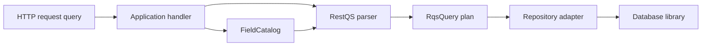
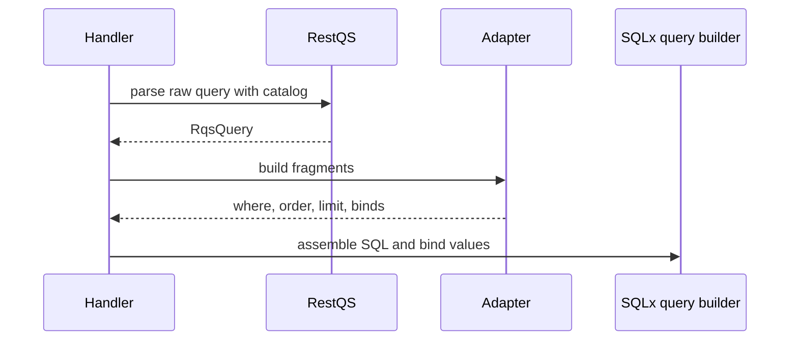

# RestQS

RestQS parses REST Query Syntax, or RQS, into a typed query plan for REST
APIs. The core crate does not generate SQL. It accepts query-string-like input,
checks every requested field against an explicit catalog, casts values, and
returns a database-neutral `RqsQuery`.

The crate suits services that treat raw request input as boundary data. A web
handler reads the query string. RestQS parses it into a plan. A repository
adapter translates the plan into database-specific query parts. Domain code
receives typed data and does not parse query strings.



## Install

Use the core parser with no runtime dependencies:

```toml
[dependencies]
restqs = "0.1.0"
```

Turn on the SQLx-oriented adapter contract with the `sqlx` feature:

```toml
[dependencies]
restqs = { version = "0.1.0", features = ["sqlx"] }
```

The `sqlx` feature exposes fragment generation for SQLx-style repositories.
It returns SQL text fragments and typed bind values. It does not open a
connection, run a query, or own transaction logic.

## Quick Start

Start with a catalog. The catalog maps public query names to trusted database
columns and value types. This catalog is the main safety boundary.

```rust
use restqs::{FieldCatalog, FilterOp, parse};

let catalog = FieldCatalog::new()
    .allow_integer("age", "users.age")?
    .allow_text("status", "users.status")?;

let query = parse("age>=18&status=in(active,pending)", &catalog)?;

assert_eq!(query.filters()[0].op(), FilterOp::Gte);
# Ok::<(), restqs::RqsError>(())
```

The parser returns a plan. It never emits a finished SQL statement.

```rust
use restqs::{FieldCatalog, RqsValue, parse};

let catalog = FieldCatalog::new().allow_text("status", "users.status")?;
let query = parse("status=active", &catalog)?;
let value = query.filters()[0].value();

assert_eq!(value, Some(&RqsValue::Text("active".to_owned())));
# Ok::<(), restqs::RqsError>(())
```

## Syntax Overview

RQS uses ordinary query-string parameters. Each parameter either creates a
filter or configures sorting, projection, or pagination.

| RQS | Plan meaning |
| --- | --- |
| `field=value` | Equals |
| `field!=value` | Not equals |
| `field>value` | Greater than |
| `field>=value` | Greater than or equal |
| `field<value` | Less than |
| `field<=value` | Less than or equal |
| `field` | Field exists |
| `!field` | Field does not exist |
| `field=in(a,b)` | Value appears in a list |
| `field!=in(a,b)` | Value does not appear in a list |
| `sort=-created_at,name` | Descending and ascending sort terms |
| `fields=id,status` | Projection fields |
| `skip=20` | Offset |
| `limit=50` | Maximum row count |

The parser supports text, integer, float, boolean, date, date-time, UUID, null,
and list values. Typed cast wrappers clarify intent for ambiguous values:
`str(value)`, `int(18)`, `float(1.5)`, `bool(true)`, `date(2026-06-06)`,
`datetime(2026-06-06T12:30:00Z)`, and
`uuid(550e8400-e29b-41d4-a716-446655440000)`.

Text search is not part of this release. Regex parsing exists, but it stays
off by default. A field must permit regex values, and the adapter must allow
regex SQL generation.

## Safe Defaults

RestQS treats the query string as untrusted input. The parser never accepts a
user field name as a database column. Every field must exist in
`FieldCatalog`. The catalog validates the trusted column identifier at
creation time.

The default limits reduce accidental high-cost queries:

| Limit | Default |
| --- | --- |
| Raw query length | 8 KiB |
| Parameter count | 128 |
| Decoded value length | 2 KiB |
| List item count | 100 |
| Maximum `limit` value | 100 |

`max_value_bytes` counts decoded UTF-8 bytes for filter values and the `sort`,
`fields`, `limit`, and `skip` controls. It includes wrappers, regex delimiters and
flags, and entire comma-separated lists. Existence filters have no value to
limit. The raw query byte limit applies separately, before decoding.

Display error messages name failure classes and valid identifiers up to 128
bytes. Malformed or longer identifiers are replaced with `[redacted]`. Use
Display or error codes for ordinary logs; error fields and Debug output retain
the original input.

## SQLx-Oriented Adapter

The SQLx adapter turns a parsed plan into query fragments. The caller owns the
base SQL, bind calls, connection, transaction, and result mapping.

```rust
use restqs::{
    FieldCatalog, parse,
    adapters::sqlx::{SqlDialect, SqlxAdapter},
};

let catalog = FieldCatalog::new()
    .allow_integer("age", "users.age")?
    .allow_text("status", "users.status")?;
let query = parse("age>=18&status=active", &catalog)?;
let parts = SqlxAdapter::new(SqlDialect::Postgres).build(&query)?;

assert_eq!(
    parts.where_clause,
    Some("\"users\".\"age\" >= $1 AND \"users\".\"status\" = $2".to_owned())
);
# Ok::<(), restqs::RqsError>(())
```

The adapter quotes allowlisted columns and returns bind values in placeholder
order. It does not concatenate user values into SQL text.



## Documented SQLx Examples

The crate does not depend on SQLx, Tokio, PostgreSQL, or SQLite. Application
code adds those crates in its own manifest. The integration guide shows
documentation-only PostgreSQL and SQLite snippets that use dynamic SQL through
`sqlx::query`.

For PostgreSQL applications:

```toml
[dependencies]
restqs = { version = "0.1.0", features = ["sqlx"] }
sqlx = { version = "0.8", default-features = false, features = ["postgres", "runtime-tokio"] }
```

For SQLite applications:

```toml
[dependencies]
restqs = { version = "0.1.0", features = ["sqlx"] }
sqlx = { version = "0.8", default-features = false, features = ["sqlite", "runtime-tokio"] }
```

The documented examples keep the security boundary visible. SQL text contains
trusted catalog columns, fixed SQL keywords, and placeholders. User values
enter the database only through `.bind(...)`.

## Architecture

Each module owns one concern. `parameter` decodes query-string text. `parser`
coordinates the plan build. `value` casts scalar and list values. `catalog`
owns public field authorization and trusted column metadata. `filter`, `sort`,
`projection`, and `pagination` compute plan pieces. `adapters` translate
completed plans.

Functions either coordinate work or compute a value. Tests follow the same
rule: each test function checks one fact.

## Documentation

- [API Guide](docs/api-guide.md)
- [Architecture](docs/architecture.md)
- [Integration Guide](docs/integrations.md)
- [Security Model](docs/security-model.md)
- [Testing Guide](docs/testing-guide.md)
- [Publishing](docs/publishing.md)
- [Release Checklist](docs/release-checklist.md)
- [Open Source Practices](docs/open-source.md)
- [Support](SUPPORT.md)
- [Contributing](CONTRIBUTING.md)
- [Security Policy](SECURITY.md)
- [Code of Conduct](CODE_OF_CONDUCT.md)
- [Changelog](CHANGELOG.md)

## Local Commands

```sh
make setup
make test
make coverage
make verify
make package-list
make package
```

`make test` runs all in-memory tests. `make coverage` fails on any uncovered
source line. `make verify` checks formatting, type checking, Clippy, tests,
doc tests, and docs.rs-style docs.

## License

Licensed under the MIT License. See [LICENSE](LICENSE).
