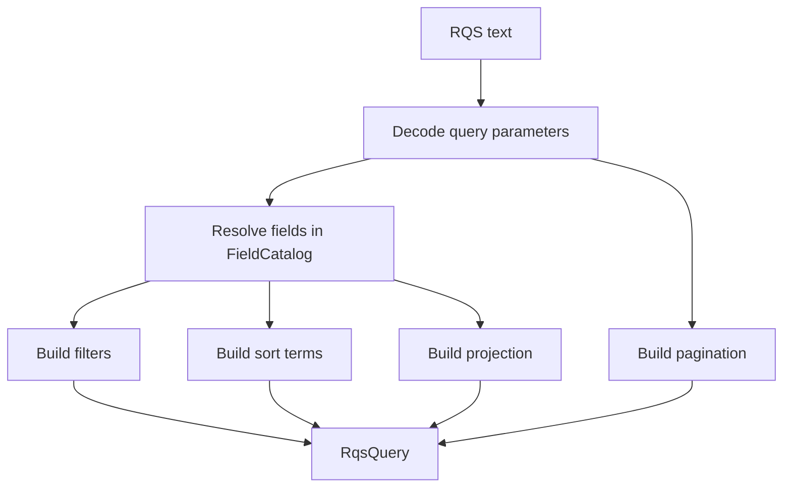

# API Guide

RestQS starts with one explicit catalog and ends with one typed plan. The catalog names the public fields accepted by an
endpoint. The plan describes filters, sort terms, projection fields, and pagination values.

The parser does not know the HTTP framework, database driver, or ORM. That separation keeps the core API small and lets
repository code choose the final query shape.



## Field Catalog

`FieldCatalog` is the public contract for an endpoint. It maps public names to trusted database column identifiers and
value kinds.

```rust
use restqs::{FieldCatalog, parse};

let catalog = FieldCatalog::new()
.allow_integer("age", "users.age") ?
.allow_text("status", "users.status") ?
.allow_boolean("active", "users.active") ?;

let query = parse("age>=18&status=active&active=true", & catalog) ?;

assert_eq!(query.filters().len(), 3);
# Ok::<(), restqs::RqsError>(())
```

The catalog accepts dotted identifiers such as `users.status`. It rejects spaces, quotes, comments, punctuation, and SQL
fragments. The parser validates field syntax before catalog lookup. Malformed names return `invalid_field_name`;
syntactically valid names that do not exist in the catalog return `unknown_field`.

Use a different catalog for each resource shape or authorization context. A public search endpoint can expose a small
set of fields. An internal endpoint can expose a larger set. Both paths use the same parser.

## Value Kinds

RestQS supports relational value kinds from the core crate. It avoids database-specific types in the parser.

| Catalog method   | Value kind | Accepted examples                                   |
|------------------|------------|-----------------------------------------------------|
| `allow_text`     | Text       | `active`, `str(active)`                             |
| `allow_integer`  | Integer    | `18`, `int(18)`                                     |
| `allow_float`    | Float      | `1.5`, `float(1.5)`                                 |
| `allow_boolean`  | Boolean    | `true`, `false`, `yes`, `no`, `on`, `off`, `1`, `0` |
| `allow_date`     | Date       | `2026-06-06`, `date(2026-06-06)`                    |
| `allow_datetime` | Date-time  | `2026-06-06T12:30:00Z`                              |
| `allow_uuid`     | UUID       | `550e8400-e29b-41d4-a716-446655440000`              |

`null` becomes `RqsValue::Null`. Lists use `in(...)` or `list(...)`. List items use the field type, so `age=in(18,21)`
returns integer values.

```rust
use restqs::{FieldCatalog, RqsValue, parse};

let catalog = FieldCatalog::new().allow_integer("age", "users.age") ?;
let query = parse("age=in(18,21)", & catalog) ?;
let value = query.filters()[0].value();

assert_eq!(
    value,
    Some(&RqsValue::List(vec![
        RqsValue::Integer(18),
        RqsValue::Integer(21),
    ]))
);
# Ok::<(), restqs::RqsError>(())
```

## Filters

Filters use the public field name on the left side. The parser resolves that name through `FieldCatalog` and stores a
`FieldRef` in the plan.

| Syntax                       | Operator              |
|------------------------------|-----------------------|
| `age=18`                     | `FilterOp::Eq`        |
| `age!=18`                    | `FilterOp::Ne`        |
| `age>18`                     | `FilterOp::Gt`        |
| `age>=18`                    | `FilterOp::Gte`       |
| `age<65`                     | `FilterOp::Lt`        |
| `age<=65`                    | `FilterOp::Lte`       |
| `deleted_at`                 | `FilterOp::Exists`    |
| `!deleted_at`                | `FilterOp::NotExists` |
| `status=in(active,pending)`  | `FilterOp::In`        |
| `status!=in(active,pending)` | `FilterOp::NotIn`     |

Comparison filters map to typed plan nodes:

```rust
use restqs::{FieldCatalog, FilterOp, parse};

let catalog = FieldCatalog::new().allow_integer("age", "users.age") ?;
let query = parse("age>=18", & catalog) ?;

assert_eq!(query.filters()[0].op(), FilterOp::Gte);
# Ok::<(), restqs::RqsError>(())
```

Existence filters use field presence. They do not carry a value.

```rust
use restqs::{FieldCatalog, FilterOp, parse};

let catalog = FieldCatalog::new().allow_text("deleted_at", "users.deleted_at") ?;
let query = parse("!deleted_at", & catalog) ?;

assert_eq!(query.filters()[0].op(), FilterOp::NotExists);
# Ok::<(), restqs::RqsError>(())
```

Duplicate filters with the same field and operator fail. This rule prevents ambiguous plans such as `age>18&age>21`.
Distinct range filters stay valid, so
`age>18&age<65` returns two filters.

## Sorting

Sorting uses `sort=` and comma-separated field names. A `-` prefix means descending order. A `+` prefix means ascending
order. A bare field name means ascending order too.

```rust
use restqs::{FieldCatalog, SortDirection, parse};

let catalog = FieldCatalog::new().allow_datetime("created_at", "users.created_at") ?;
let query = parse("sort=-created_at", & catalog) ?;

assert_eq!(query.sort()[0].direction(), SortDirection::Desc);
# Ok::<(), restqs::RqsError>(())
```

Query strings treat `+` as a space. Encode an explicit plus sign as `%2B`:
`sort=%2Bcreated_at`.

## Projection

Projection uses `fields=` and comma-separated field names. The plan stores the resolved catalog fields, not raw text.

```rust
use restqs::{FieldCatalog, parse};

let catalog = FieldCatalog::new()
.allow_text("name", "users.name") ?
.allow_text("email", "users.email") ?;
let query = parse("fields=name,email", & catalog) ?;

assert_eq!(query.projection().fields().len(), 2);
# Ok::<(), restqs::RqsError>(())
```

An empty `fields=` value produces an empty projection. Application code can interpret that as a default projection.

## Pagination

`limit=` and `skip=` produce pagination data. `limit` caps the maximum row count. `skip` represents an offset.

```rust
use restqs::{FieldCatalog, parse};

let catalog = FieldCatalog::new().allow_text("status", "users.status") ?;
let query = parse("limit=25&skip=50", & catalog) ?;

assert_eq!(query.pagination().limit(), Some(25));
# Ok::<(), restqs::RqsError>(())
```

The default maximum `limit` is 100. Use `ParserConfig` for a resource-specific cap:

```rust
use restqs::{FieldCatalog, Parser, ParserConfig, ParserLimits};

let catalog = FieldCatalog::new().allow_text("status", "users.status") ?;
let limits = ParserLimits {
max_limit: 250,
..ParserLimits::default ()
};
let parser = Parser::with_config( & catalog, ParserConfig::with_limits(limits));
let query = parser.parse("limit=200") ?;

assert_eq!(query.pagination().limit(), Some(200));
# Ok::<(), restqs::RqsError>(())
```

Negative pagination values fail with `negative_pagination`. Non-numeric values fail with `invalid_pagination`.

## Regex

Regex is an opt-in capability. The field must allow regex values. The adapter must allow regex SQL generation.

```rust
use restqs::{Field, FieldCatalog, FilterOp, ValueKind, parse};

let email = Field::new("email", "users.email", ValueKind::Text) ?.allow_regex();
let catalog = FieldCatalog::new().allow(email) ?;
let query = parse("email=/@example.com$/i", & catalog) ?;

assert_eq!(query.filters()[0].op(), FilterOp::Regex);
# Ok::<(), restqs::RqsError>(())
```

Regex support differs across databases. Keep it off for public endpoints until the repository adapter has clear dialect
rules and cost limits.

## Error Codes

`RqsError::error_code()` gives stable strings for API responses and tests. Library-generated Display messages name the
failure class and show only valid dotted ASCII field or column identifiers of at most 128 bytes. Malformed or longer
identifiers are replaced in full with `[redacted]`, so control characters and value text misidentified as a field do not
enter the message. This display limit does not restrict accepted catalog identifiers.

Use Display (`{}`) or error codes for ordinary logs and public error responses. Error fields and Debug (`{:?}`) retain
the original input and are outside this redaction contract.

Malformed nonempty field names now return `invalid_field_name` instead of `unknown_field`. Existing error-code strings
are unchanged; valid unknown names still return `unknown_field`.

| Code                      | Meaning                                         |
|---------------------------|-------------------------------------------------|
| `invalid_field_name`      | Field syntax was empty or invalid               |
| `unknown_field`           | Public field was not in the catalog             |
| `invalid_value`           | Value did not match the catalog type            |
| `regex_disabled`          | Regex was used on a field that did not allow it |
| `text_search_unsupported` | `$text=` was requested                          |
| `duplicate_filter`        | Same field and operator appeared twice          |
| `limit_too_large`         | Requested `limit` exceeded parser config        |
| `too_many_parameters`     | Query had more parameters than allowed          |
| `too_many_list_items`     | List had more items than allowed                |

Services can map these codes to HTTP 400 responses. Authorization failures belong in application code, not in RestQS.
