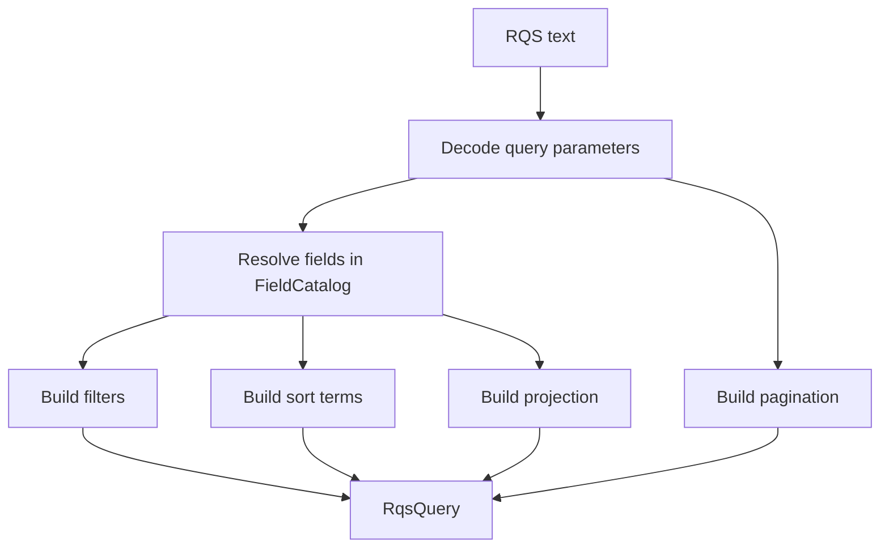

# API Guide

This guide describes the unreleased 0.2 API. See the [migration guide](migration-0.2.md) for changes from 0.1.x.

RestQS starts with one explicit catalog and ends with one typed plan. The catalog names the public fields accepted by an
endpoint. The plan describes filters, sort terms, projection fields, and pagination values.

The parser does not know the HTTP framework, database driver, or ORM. That separation keeps the core API small and lets
repository code choose the final query shape.



## Field Catalog

`FieldCatalog` is the public contract for an endpoint. It authorizes logical public names and defines value kinds and
query capabilities. Physical storage names are configured separately by each adapter.

```rust
use restqs::{FieldCatalog, parse};

let catalog = FieldCatalog::new()
.allow_integer("age") ?
.allow_text("status") ?
.allow_boolean("active") ?;

let query = parse("age>=18&status=active&active=true", & catalog) ?;

assert_eq!(query.filters().len(), 3);
# Ok::<(), restqs::RqsError>(())
```

The public query grammar accepts dotted names such as `profile.status`. This is logical identity, not a database path.
It rejects spaces, quotes, comments, and other punctuation. The parser validates field syntax and reserved names before
catalog lookup. Malformed names return `invalid_field_name`; other valid names absent from the catalog return `unknown_field`.

The exact lowercase names `sort`, `fields`, `limit`, and `skip` are reserved for query controls. `Field::new`, all
catalog builders, and logical keys in `SqlxColumnMap` reject them with `reserved_field_name`. The same error applies to
field references such as `sort=limit`, `fields=skip`, or `limit!=5`. Control syntax such as `limit=5` remains unchanged.
Matching is exact and case-sensitive: `Limit`, `profile.limit`, and `limit_value` remain valid logical names. In requests,
matching happens after URL decoding. Physical SQL columns may still use these names through a distinct public alias; see
[the migration guide](migration-0.2.md#reserved-query-control-names). `$text` is already invalid field syntax, and
`$text=` retains its `text_search_unsupported` error.

Use a different catalog for each resource shape or authorization context. A public search endpoint can expose a small
set of fields. An internal endpoint can expose a larger set. Both paths use the same parser.

## Value Kinds

RestQS supports storage-independent value kinds in the core crate. It avoids database-specific types in the parser.

| Catalog method   | Value kind | Accepted examples                                   |
|------------------|------------|-----------------------------------------------------|
| `allow_text`     | Text       | `active`, `str(active)`                             |
| `allow_integer`  | Integer    | `18`, `int(18)`                                     |
| `allow_float`    | Float      | `1.5`, `float(1.5)`                                 |
| `allow_boolean`  | Boolean    | `true`, `false`, `yes`, `no`, `on`, `off`, `1`, `0` |
| `allow_date`     | Date       | `2026-06-06`, `date(2026-06-06)`                    |
| `allow_datetime` | Date-time  | `2026-06-06T12:30:00Z`                              |
| `allow_uuid`     | UUID       | `550e8400-e29b-41d4-a716-446655440000`              |

`null` becomes `RqsValue::Null`. Lists use `in(...)` or `list(...)`. List items use the field type, so `age=in(18,21)`
returns integer values.

The top-level `null` literal is case-insensitive. The parser retains the comparison operator and a typed null value in
the plan. In the SQLx adapter, equality with null becomes `IS NULL` and inequality becomes `IS NOT NULL` for PostgreSQL,
MySQL, and SQLite. These predicates consume no binds or placeholders. A following scalar value uses the next available
placeholder, starting at `$1` for PostgreSQL when there are no earlier binds.

The SQLx adapter rejects `>`, `>=`, `<`, and `<=` with a null value using `adapter_unsupported` and feature metadata
`ordered null comparison`. This error occurs during SQL translation; the core parser still produces a typed plan.
Use `str(null)` on a text field to compare against the literal text `null` with an ordinary bind value.

```rust
use restqs::{FieldCatalog, RqsValue, parse};

let catalog = FieldCatalog::new().allow_integer("age") ?;
let query = parse("age=in(18,21)", & catalog) ?;
let value = query.filters()[0].value();

assert_eq!(
    value,
    Some(&RqsValue::List(vec![
        RqsValue::Integer(18),
        RqsValue::Integer(21),
    ]))
);
# Ok::<(), restqs::RqsError>(())
```

`ParserLimits::max_value_bytes` limits decoded UTF-8 bytes for filter values and the `sort`, `fields`, `limit`, and `skip`
controls. Cast wrappers, regex delimiters and flags, and entire comma-separated lists count toward the limit. Existence
filters have no value to limit. Oversized values return `value_too_large` before their contents are interpreted; regex
values within the limit still require field permission.

### Dates and Date-Times

Dates use `YYYY-MM-DD` with four ASCII year digits (`0000` through `9999`) and Gregorian month lengths and leap-year
rules. This includes the century rule: 1900 is not a leap year, while 2000 is. Years use proleptic Gregorian numbering,
including year zero.

Date-times use this [RFC 3339-based format](https://www.rfc-editor.org/rfc/rfc3339#section-5.6):

```text
YYYY-MM-DD[Tt]HH:MM:SS[.digits](Z|z|+HH:MM|-HH:MM)
```

Here brackets mark optional parts, except `[Tt]`, which means either letter. The final parentheses list offset choices.
Clock and offset hours range from `00` to `23`; minutes and seconds range from `00` to `59`. The offset is mandatory.
Leap seconds (`60`) are outside the supported format. A space cannot replace `T` or `t`.

An optional fraction starts with a period and contains one or more ASCII digits. Fraction precision is preserved and
bounded only by the configured query and value byte limits. Parsed strings retain their original letter case and
offset, including `-00:00`; the parser does not normalize to UTC or round fractions. In query strings, encode positive
offset signs as `%2B`, since a raw `+` decodes to a space.

The same validation applies to scalar values, `date(...)` and `datetime(...)` wrappers, and list items (after the existing
list whitespace trimming). Invalid dates, times, or offsets return `invalid_value` with the field name and expected
`date` or `datetime` type.

## Filters

Filters use the public field name on the left side. The parser resolves that name through `FieldCatalog` and stores a
`FieldRef` in the plan.

After URL decoding, the first `!`, `>`, `<`, or `=` marks the comparison boundary. The parser recognizes the longest
supported operator at that position and passes the remaining text to value parsing without searching it for more
operators. For example, `name=a%3Eb` and `name=str(a%3Eb)` both produce the text `a>b`. Encoded operators at the field
boundary work as well: `age%3E%3D18` means `age>=18`.

A value can itself start with an operator character: `name==value` compares against the text `=value`, and
`name>=<=value` uses `>=` with the text `<=value`. A lone `!` after the field, such as `name!value`, returns
`invalid_operator`. Leading `!` keeps its separate not-exists meaning, and a field without an operator remains an
existence filter. Empty field names are still rejected.

| Syntax                       | Operator              |
|------------------------------|-----------------------|
| `age=18`                     | `FilterOp::Eq`        |
| `age!=18`                    | `FilterOp::Ne`        |
| `age>18`                     | `FilterOp::Gt`        |
| `age>=18`                    | `FilterOp::Gte`       |
| `age<65`                     | `FilterOp::Lt`        |
| `age<=65`                    | `FilterOp::Lte`       |
| `deleted_at`                 | `FilterOp::Exists`    |
| `!deleted_at`                | `FilterOp::NotExists` |
| `status=in(active,pending)`  | `FilterOp::In`        |
| `status!=in(active,pending)` | `FilterOp::NotIn`     |

Comparison filters map to typed plan nodes:

```rust
use restqs::{FieldCatalog, FilterOp, parse};

let catalog = FieldCatalog::new().allow_integer("age") ?;
let query = parse("age>=18", & catalog) ?;

assert_eq!(query.filters()[0].op(), FilterOp::Gte);
# Ok::<(), restqs::RqsError>(())
```

Existence filters use field presence. They do not carry a value.

```rust
use restqs::{FieldCatalog, FilterOp, parse};

let catalog = FieldCatalog::new().allow_text("deleted_at") ?;
let query = parse("!deleted_at", & catalog) ?;

assert_eq!(query.filters()[0].op(), FilterOp::NotExists);
# Ok::<(), restqs::RqsError>(())
```

Duplicate filters with the same field and operator fail. This rule prevents ambiguous plans such as `age>18&age>21`.
Distinct range filters stay valid, so
`age>18&age<65` returns two filters.

## Sorting

Sorting uses `sort=` and comma-separated field names. A `-` prefix means descending order. A `+` prefix means ascending
order. A bare field name means ascending order too.

```rust
use restqs::{FieldCatalog, SortDirection, parse};

let catalog = FieldCatalog::new().allow_datetime("created_at") ?;
let query = parse("sort=-created_at", & catalog) ?;

assert_eq!(query.sort()[0].direction(), SortDirection::Desc);
# Ok::<(), restqs::RqsError>(())
```

Query strings treat `+` as a space. Encode an explicit plus sign as `%2B`:
`sort=%2Bcreated_at`.

## Projection

Projection uses `fields=` and comma-separated field names. The plan stores the resolved catalog fields, not raw text.

```rust
use restqs::{FieldCatalog, parse};

let catalog = FieldCatalog::new()
.allow_text("name") ?
.allow_text("email") ?;
let query = parse("fields=name,email", & catalog) ?;

assert_eq!(query.projection().fields().len(), 2);
# Ok::<(), restqs::RqsError>(())
```

An empty `fields=` value produces an empty projection. Application code can interpret that as a default projection.

## Pagination

`limit=` and `skip=` produce pagination data. `limit` caps the maximum row count. `skip` represents an offset.

```rust
use restqs::{FieldCatalog, parse};

let catalog = FieldCatalog::new().allow_text("status") ?;
let query = parse("limit=25&skip=50", & catalog) ?;

assert_eq!(query.pagination().limit(), Some(25));
# Ok::<(), restqs::RqsError>(())
```

The default maximum `limit` is 100. Use `ParserConfig` for a resource-specific cap:

```rust
use restqs::{FieldCatalog, Parser, ParserConfig, ParserLimits};

let catalog = FieldCatalog::new().allow_text("status") ?;
let limits = ParserLimits {
max_limit: 250,
..ParserLimits::default ()
};
let parser = Parser::with_config( & catalog, ParserConfig::with_limits(limits));
let query = parser.parse("limit=200") ?;

assert_eq!(query.pagination().limit(), Some(200));
# Ok::<(), restqs::RqsError>(())
```

Negative pagination values fail with `negative_pagination`. Non-numeric values fail with `invalid_pagination`.

## Regex

Regex is an opt-in capability. The field must allow regex values. The adapter must allow regex SQL generation.

Only equality supports regex literals:

| Syntax | Result |
| --- | --- |
| `email=/admin/` | Positive regex match, requiring both permission gates |
| `email!=/admin/` | `invalid_operator`; regex negation is unsupported |
| `email>/admin/`, `email>=/admin/` | `invalid_operator` |
| `email</admin/`, `email<=/admin/` | `invalid_operator` |

For a resolved field and recognized regex literal, value-size validation runs first, followed by operator validation,
then field permission, then flag validation. An unsupported operator returns `invalid_operator` even when the field
has regex disabled. An equality regex without field permission still returns `regex_disabled`. These restrictions apply
to recognized regex literals; `email!=str(/admin/)` compares against the literal text `/admin/`.

The parser recognizes the suffix flags `i` (case insensitive), `m` (multiline), `s` (dot matches newlines), and `x`
(extended syntax). Each flag can occur at most once, in any order. Unknown flags, uppercase flags, whitespace, and
duplicates such as `/admin/ii` return `invalid_regex_flags`. Accepted flags retain their input order in
`RegexLiteral::flags()`. The error does not include the submitted pattern or flags.

The following matrix describes the current SQLx adapter, with both regex permission gates enabled:

| Suffix flags | PostgreSQL | MySQL | SQLite |
| --- | --- | --- | --- |
| None | `column ~ $1` | `column REGEXP ?` | `adapter_unsupported` |
| `i` | `column ~* $1` | `adapter_unsupported` | `adapter_unsupported` |
| `m` | `adapter_unsupported` | `adapter_unsupported` | `adapter_unsupported` |
| `s` | `adapter_unsupported` | `adapter_unsupported` | `adapter_unsupported` |
| `x` | `adapter_unsupported` | `adapter_unsupported` | `adapter_unsupported` |

Any combination containing an unsupported flag is rejected in full, including `/admin/im` on PostgreSQL. The error's
`feature` is `postgres regex flags` or `mysql regex flags` for unsupported flags, and `sqlite regex` for SQLite.
These are limits of this adapter's translation; the parser preserves recognized flags for custom adapters.

Patterns remain unmodified bind values and use the database's native regex syntax. PostgreSQL's `~` and `~*` operators
select case-sensitive and case-insensitive matching, respectively; embedded pattern options can override that choice
as documented in [PostgreSQL pattern matching](https://www.postgresql.org/docs/current/functions-matching.html#FUNCTIONS-POSIX-REGEXP).
With no suffix flags, MySQL matching follows the arguments' collations and its regex engine; omitting flags does not
guarantee case sensitivity. See [MySQL regular expressions](https://dev.mysql.com/doc/refman/8.4/en/regexp.html).

```rust
use restqs::{Field, FieldCatalog, FilterOp, ValueKind, parse};

let email = Field::new("email", ValueKind::Text) ?.allow_regex();
let catalog = FieldCatalog::new().allow(email) ?;
let query = parse("email=/@example.com$/i", & catalog) ?;

assert_eq!(query.filters()[0].op(), FilterOp::Regex);
# Ok::<(), restqs::RqsError>(())
```

Regex support differs across databases. Keep it off for public endpoints until the repository adapter has clear dialect
rules and cost limits.

## Error Codes

`RqsError::error_code()` gives stable strings for API responses and tests. Library-generated Display messages name the
failure class and show only valid dotted ASCII field or column identifiers of at most 128 bytes. Malformed or longer
identifiers are replaced in full with `[redacted]`, so control characters and value text misidentified as a field do not
enter the message. This display limit does not restrict accepted catalog identifiers.

Use Display (`{}`) or error codes for ordinary logs and public error responses. Error fields and Debug (`{:?}`) retain
the original input and are outside this redaction contract.

Malformed nonempty field names return `invalid_field_name`. Reserved control names in field positions return
`reserved_field_name`; other valid unknown names return `unknown_field`. Existing error-code strings are unchanged.

| Code                      | Meaning                                         |
|---------------------------|-------------------------------------------------|
| `invalid_field_name`      | Field syntax was empty or invalid               |
| `reserved_field_name`     | Logical field name collides with a query control |
| `unknown_field`           | Public field was not in the catalog             |
| `missing_column_mapping` | SQL adapter has no mapping for a referenced logical field |
| `duplicate_column_mapping` | SQL configuration registered the same logical field twice |
| `invalid_column_name`    | SQL configuration contains an invalid physical identifier |
| `invalid_operator`        | Invalid operator syntax or unsupported operator/value combination |
| `invalid_value`           | Value did not match the catalog type            |
| `value_too_large`         | Decoded filter or control value exceeded the byte limit |
| `regex_disabled`          | Regex was used on a field that did not allow it |
| `invalid_regex_flags`     | Regex suffix flags contain an unknown or repeated flag |
| `text_search_unsupported` | `$text=` was requested                          |
| `duplicate_filter`        | Same field and operator appeared twice          |
| `limit_too_large`         | Requested `limit` exceeded parser config        |
| `too_many_parameters`     | Query had more parameters than allowed          |
| `too_many_list_items`     | List had more items than allowed                |
| `adapter_unsupported`     | SQL translation cannot represent the requested feature, including regex flags and ordered null comparisons |

For `value_too_large`, the `field` metadata identifies the filter's public field name or the control name (`sort`,
`fields`, `limit`, or `skip`).

Services can map these codes to HTTP 400 responses. Authorization failures belong in application code, not in RestQS.
