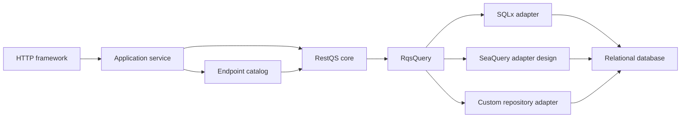
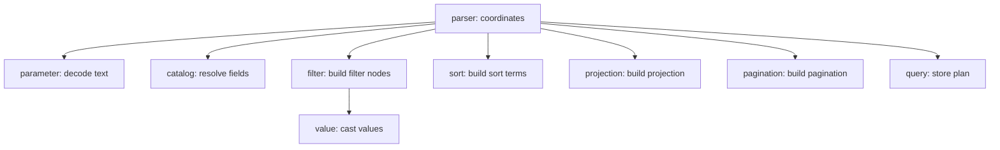
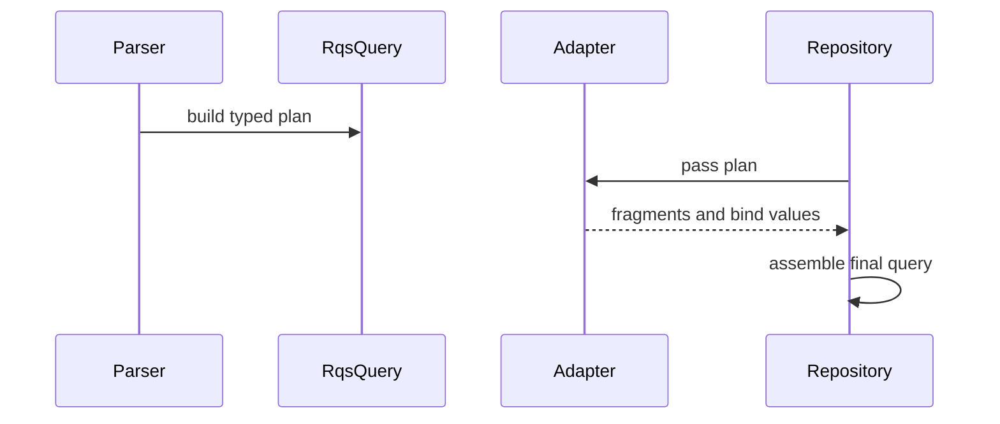

# Architecture

RestQS is a boundary library. It receives request query text and returns a typed plan that application adapters can
translate into database calls. It is not an ORM, authorization layer, query executor, request framework, or SQL builder
in the core crate.

The core design follows hexagonal architecture. The inbound side accepts raw RQS text and a trusted field catalog. The
outbound side receives `RqsQuery`. Adapters live at that outbound edge and translate the plan for a database library.

This boundary gives the parser a narrow job. It validates shape, resolves fields, casts values, and returns data. It
does not decide who can see a field. The host application builds the catalog for each endpoint, tenant, or role.

## Responsibility Model

Each module owns one reason to change. `parameter` decodes query-string text.
`parser` coordinates the parsing flow. `catalog` owns public field validation and trusted column metadata. `value` casts
scalar and list values. `filter`,
`sort`, `projection`, and `pagination` construct plan pieces. `adapters`
translate finished plans.

A function either coordinates work or computes a value. A coordinator calls smaller functions and assembles state. A
computation receives input and returns one result. It does not perform unrelated orchestration.

This rule keeps changes local. A new scalar type belongs in `catalog` and
`value`. A new RQS operator belongs in `filter` and the parser split logic. A new database integration belongs in
`adapters`.

## Plan Shape

`RqsQuery` is the stable core output. It contains four sections:

| Section    | Rust type       | Purpose                           |
|------------|-----------------|-----------------------------------|
| Filters    | `Vec<Filter>`   | Field predicates and typed values |
| Sort       | `Vec<SortTerm>` | Ordered field directions          |
| Projection | `Projection`    | Fields requested for selection    |
| Pagination | `Pagination`    | Limit and offset data             |

Each filter stores a `FieldRef`, not raw user text. The field reference comes from `FieldCatalog`, so adapters receive
trusted column names only. User input stays in typed `RqsValue` values. Repository code binds those values through the
database library.

The plan is database-neutral. SQLx, SeaQuery, and custom repositories can read the same plan. This keeps parsing tests
independent from database tests.

## Adapter Boundary

Adapters depend on the plan. The plan does not depend on adapters. Cargo feature flags keep heavier integrations outside
the core parser.

The SQLx-oriented adapter returns:

| Fragment       | Meaning                                          |
|----------------|--------------------------------------------------|
| `where_clause` | SQL predicate text without the `WHERE` keyword   |
| `projection`   | Quoted columns for select lists                  |
| `order_by`     | SQL ordering text without the `ORDER BY` keyword |
| `limit`        | Row cap as an integer                            |
| `offset`       | Offset as an integer                             |
| `binds`        | Values in placeholder order                      |

The adapter does not own connection state. It does not execute SQL. The host repository builds the final query and binds
values.

## Error Boundary

`RqsError` gives stable error codes. Services can map those codes to HTTP responses, metrics, or tests. Display text
uses a pure identifier-redaction computation: valid dotted ASCII names up to 128 bytes remain visible, and other names
become `[redacted]`. The internal `identifier` module supplies the syntax computation shared by catalog validation and
error formatting. The parser coordinates syntax validation and catalog lookup. Error fields and Debug output retain
the original input and are outside the Display redaction contract.

Parser errors represent invalid RQS input. Adapter errors represent unsupported translation for a valid plan.
Authorization errors belong outside RestQS. The application decides the catalog and can reject the request before
parsing.

## Test Architecture

Tests mirror the module boundaries. Parser tests prove syntax and plan shape. Catalog tests prove identifier validation.
Value tests prove type parsing. Adapter tests prove fragment text and bind order.

Each test has one assertion. A test can prepare data, parse input, and call a helper. The final verification checks one
fact. This keeps failures precise and keeps test intent clear during review.
