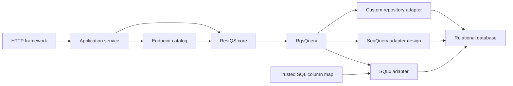
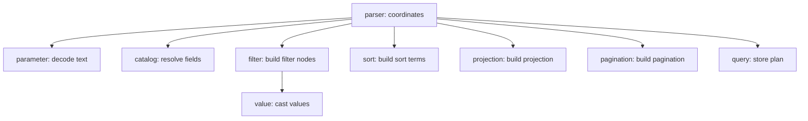
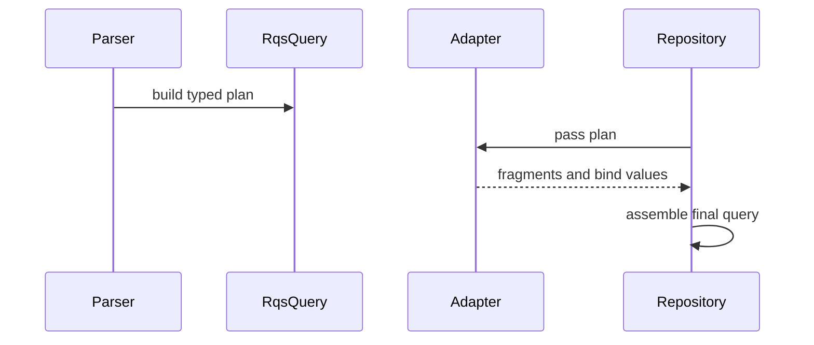

# Architecture

RestQS is a boundary library. It receives request query text and returns a typed plan that application adapters can
translate into database calls. It is not an ORM, authorization layer, query executor, request framework, or SQL builder
in the core crate.

The core design follows hexagonal architecture. The inbound side accepts raw RQS text and a trusted field catalog. The
outbound side receives `RqsQuery`. Adapters live at that outbound edge and translate the plan for a database library.

This boundary gives the parser a narrow job. It validates shape, resolves fields, casts values, and returns data. It
does not decide who can see a field. The host application builds the catalog for each endpoint, tenant, or role.

## Responsibility Model

Each module owns one reason to change. `parameter` decodes query-string text.
`parser` coordinates the parsing flow. `catalog` owns logical field validation, value kinds, and capabilities. `value` casts
scalar and list values. `filter`,
`sort`, `projection`, and `pagination` construct plan pieces. `adapters`
translate finished plans.

A function either coordinates work or computes a value. A coordinator calls smaller functions and assembles state. A
computation receives input and returns one result. It does not perform unrelated orchestration.

The parser's internal `parameter_policy` module classifies decoded text into an explicit parameter kind and validates
control value sizes without changing the plan. `apply_parameter` coordinates classification, validation, and dispatch.
The internal `filter_policy` module computes duplicate identities from logical field names and normalized operator
tokens, then checks them against an immutable set of seen identities. `apply_filter` parses and validates before
explicitly updating that set and appending the filter. Repeated controls retain their existing replacement behavior;
filter validation errors still take precedence over duplicate rejection.

Filter splitting is a pure computation over decoded text. It finds the field boundary, recognizes the longest supported
operator at that position, and returns borrowed field and value slices. The parser coordinates catalog resolution and
typed value parsing after this split; it does not reinterpret comparison characters inside the value as field syntax.

Sort-token interpretation is a pure computation in `sort`. It removes at most one leading `-` or `+` from a decoded
token and returns the borrowed logical field name and direction, defaulting bare names to ascending. `parse_sort_term`
coordinates this split, authorized catalog resolution, and `SortTerm` construction. Empty or malformed names still
fail field validation, and valid unknown names still fail catalog lookup. URL decoding remains in `parameter`, so
an explicit ascending prefix in a query string must use `%2B`.

The internal `temporal` module owns pure calendar, clock, fraction, and offset validation. The value layer uses those
computations before constructing date or date-time values. Scalars, wrappers, and lists share that path, so validation
does not depend on an adapter, external configuration, or a clock.

The filter coordinator calls pure regex-operator and suffix-flag validators before creating a regex plan node. These
policies stay in the core, so every adapter receives the same equality-only contract with unique, recognized flags.
Dialect support stays in the adapter: a pure computation selects the regex operator or returns an unsupported error.
The regex clause coordinator calls that computation before adding the pattern bind, then delegates SQL formatting.

This rule keeps changes local. A new scalar type belongs in `catalog` and
`value`. A new RQS operator belongs in `filter` and the parser split logic. A new database integration belongs in
`adapters`.

## Plan Shape

`RqsQuery` is the stable core output. It contains four sections:

| Section    | Rust type       | Purpose                           |
|------------|-----------------|-----------------------------------|
| Filters    | `Vec<Filter>`   | Field predicates and typed values |
| Sort       | `Vec<SortTerm>` | Ordered field directions          |
| Projection | `Projection`    | Fields requested for selection    |
| Pagination | `Pagination`    | Limit and offset data             |

Each filter stores a logical `FieldRef` resolved through `FieldCatalog`, including its name, value kind, and regex
permission. Filters, sorting, and projections contain no physical column names. User input stays in typed `RqsValue`
values. SQL repositories supply a separate trusted column map and bind values through the database library.

The plan is database-neutral. SQLx, SeaQuery, and custom repositories can read the same plan. This keeps parsing tests
independent from database tests.

## Adapter Boundary

Adapters depend on the plan. The plan does not depend on adapters. Cargo feature flags keep heavier integrations outside
the core parser.

`SqlxColumnMap` lives at the SQL adapter boundary and validates physical identifiers when configured. `SqlxAdapter`
requires this mapping and resolves every referenced field explicitly, including fields used only for sorting or
projection. It rejects missing entries instead of deriving identifiers from logical names. Catalog authorization
remains independent: a mapping cannot make an unlisted request field valid.

The same plan can be translated with different physical schemas or consumed without SQL. The
[in-memory example](../examples/in_memory.rs) reads logical `age` and its integer value to filter application records.
It explicitly rejects unsupported plan shapes. See the [0.2 migration](migration-0.2.md) for the API transition.

The SQLx-oriented adapter returns:

| Fragment       | Meaning                                          |
|----------------|--------------------------------------------------|
| `where_clause` | SQL predicate text without the `WHERE` keyword   |
| `projection`   | Quoted columns for select lists                  |
| `order_by`     | SQL ordering text without the `ORDER BY` keyword |
| `limit`        | Row cap as an integer                            |
| `offset`       | Offset as an integer                             |
| `binds`        | Values in placeholder order                      |

The adapter does not own connection state. It does not execute SQL. The host repository builds the final query and binds
values.

SQL null comparison semantics belong in the adapter. A pure computation selects `IS NULL`, `IS NOT NULL`, or an
unsupported-comparison error from the typed value and operator. The comparison coordinator returns a null predicate
without changing bind state, or allocates a scalar bind and delegates SQL formatting to a pure computation. The core
plan retains its comparison operator and typed null value.

Placeholder formatting is a pure computation over the SQL dialect and an explicit one-based bind position. The bind
coordinator appends the value, reads the resulting position, and calls that formatter. Comparisons, lists, and regex
share this path: PostgreSQL receives a continuous numbered sequence, while MySQL and SQLite receive anonymous `?`
placeholders. Null comparisons and existence predicates do not consume positions.

## Error Boundary

`RqsError` gives stable error codes. Services can map those codes to HTTP responses, metrics, or tests. Display text
uses a pure identifier-redaction computation: valid dotted ASCII names up to 128 bytes remain visible, and other names
become `[redacted]`. The internal `identifier` module supplies the syntax computation shared by catalog validation and
error formatting. The parser coordinates syntax validation and catalog lookup. Error fields and Debug output retain
the original input and are outside the Display redaction contract.

Parser errors represent invalid RQS input. Adapter errors represent unsupported translation for a valid plan.
Authorization errors belong outside RestQS. The application decides the catalog and can reject the request before
parsing.

## Test Architecture

Tests mirror the module boundaries. Parser tests prove syntax and plan shape. Catalog tests prove identifier validation.
Value tests prove type parsing. Adapter tests prove fragment text and bind order.

Each test has one assertion. A test can prepare data, parse input, and call a helper. The final verification checks one
fact. This keeps failures precise and keeps test intent clear during review.
