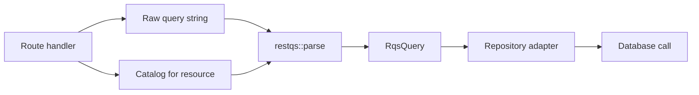
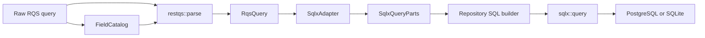
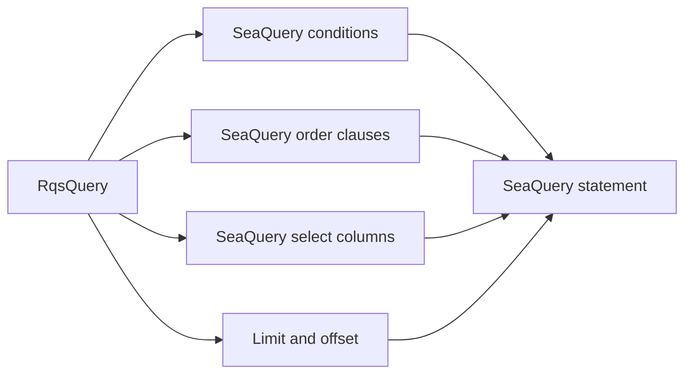

# Integration Guide

RestQS keeps framework and database code outside the core parser. A REST handler extracts the raw query string, selects
a field catalog, and parses RQS. A repository receives the `RqsQuery` plan and translates it for the database layer.



The plan boundary matters. Web code stays responsible for request extraction. Application code stays responsible for
authorization and catalog choice. Repository code stays responsible for SQL, query builders, transactions, and result
mapping.

## SQLx-Oriented Fragment Generation

Turn on the `sqlx` feature to use the built-in SQL fragment adapter:

```toml
[dependencies]
restqs = { version = "0.1.1", features = ["sqlx"] }
```

The adapter accepts a parsed plan and returns SQLx-ready parts:

```rust
use restqs::{
    FieldCatalog, parse,
    adapters::sqlx::{SqlDialect, SqlxAdapter},
};

let catalog = FieldCatalog::new()
.allow_integer("age", "users.age") ?
.allow_text("status", "users.status") ?;
let query = parse("age>=18&status=active&sort=-age&limit=25", & catalog) ?;
let parts = SqlxAdapter::new(SqlDialect::Postgres).build( & query) ?;

assert_eq!(parts.binds.len(), 2);
# Ok::<(), restqs::RqsError>(())
```

The adapter returns the `WHERE` clause without the `WHERE` keyword. It returns the `ORDER BY` clause without the
`ORDER BY` keyword. It keeps `limit` and
`offset` as integers. It stores bind values in placeholder order.

For PostgreSQL, the adapter emits numbered placeholders such as `$1` and `$2`. For MySQL and SQLite, it emits `?`
placeholders. It quotes identifiers with the dialect rules and only quotes trusted catalog columns.

Null equality and inequality produce `IS NULL` and `IS NOT NULL` in every supported dialect and consume no bind values.
For example, `status=null&age>=18` produces `"users"."status" IS NULL AND "users"."age" >= $1` for PostgreSQL, with only
`RqsValue::Integer(18)` in `parts.binds`. Bind values from `parts.binds` in order; filter positions do not determine bind
positions. Ordered comparisons with null fail at adapter build time with `adapter_unsupported` and feature metadata
`ordered null comparison`.

## SQLx Repository Pattern

The repository owns the base SQL and the bind calls. RestQS provides the parts. The final assembly lives beside result
mapping and transaction code.

```rust
use restqs::{RqsValue, adapters::sqlx::SqlxQueryParts};

fn users_select_sql(parts: &SqlxQueryParts) -> String {
    let projection = if parts.projection.is_empty() {
        "\"users\".\"id\", \"users\".\"status\"".to_owned()
    } else {
        parts.projection.join(", ")
    };

    let mut sql = format!("SELECT {projection} FROM \"users\"");
    if let Some(where_clause) = &parts.where_clause {
        sql.push_str(" WHERE ");
        sql.push_str(where_clause);
    }
    if let Some(order_by) = &parts.order_by {
        sql.push_str(" ORDER BY ");
        sql.push_str(order_by);
    }
    sql
}

let parts = SqlxQueryParts {
where_clause: Some("\"users\".\"status\" = $1".to_owned()),
projection: Vec::new(),
order_by: None,
limit: Some(25),
offset: None,
binds: vec![RqsValue::Text("active".to_owned())],
};

assert_eq!(
    users_select_sql(&parts),
    "SELECT \"users\".\"id\", \"users\".\"status\" FROM \"users\" WHERE \"users\".\"status\" = $1"
);
```

Real SQLx code then binds each `RqsValue` with the matching database type. Keep that mapping inside the repository. That
location has the schema knowledge needed for precise binding.

## Documentation-Only SQLx Examples

The crate does not depend on SQLx, Tokio, PostgreSQL, or SQLite. Application code chooses those crates and versions in
its own manifest. The following snippets show the path from raw RQS text to database rows. They keep request extraction,
parsing, SQL assembly, bind mapping, and row decoding in distinct functions.



The snippets use `sqlx::query` instead of SQLx macros. That keeps query text assembled at runtime. The application still
binds every value through SQLx.

### PostgreSQL

An application that uses PostgreSQL can depend on SQLx in its own manifest:

```toml
[dependencies]
restqs = { version = "0.1.1", features = ["sqlx"] }
sqlx = { version = "0.8", default-features = false, features = ["postgres", "runtime-tokio"] }
```

Repository code can then translate a parsed plan into a SQLx query. The example below binds text, integer, boolean, and
float values. Date, date-time, and UUID values stay as text here. A repository can bind those variants to richer database
types after it owns the schema rules.

```rust
use restqs::{
    FieldCatalog, RqsValue, parse,
    adapters::sqlx::{SqlDialect, SqlxAdapter, SqlxQueryParts},
};
use sqlx::{PgPool, Row};

async fn list_users(pool: &PgPool, raw: &str) -> Result<Vec<(i64, String)>, Box<dyn std::error::Error>> {
    let catalog = FieldCatalog::new()
        .allow_integer("id", "users.id")?
        .allow_text("name", "users.name")?
        .allow_text("status", "users.status")?
        .allow_integer("age", "users.age")?
        .allow_boolean("active", "users.active")?;

    let query = parse(raw, &catalog)?;
    let parts = SqlxAdapter::new(SqlDialect::Postgres).build(&query)?;
    let sql = postgres_users_sql(&parts);
    let mut query = sqlx::query(&sql);

    for value in &parts.binds {
        query = bind_postgres_value(query, value)?;
    }

    let rows = query.fetch_all(pool).await?;
    let users = rows
        .into_iter()
        .map(|row| Ok((row.try_get("id")?, row.try_get("name")?)))
        .collect::<Result<Vec<_>, sqlx::Error>>()?;

    Ok(users)
}

fn postgres_users_sql(parts: &SqlxQueryParts) -> String {
    let projection = if parts.projection.is_empty() {
        r#""users"."id", "users"."name""#.to_owned()
    } else {
        parts.projection.join(", ")
    };

    let mut sql = format!("SELECT {projection} FROM users");
    if let Some(where_clause) = &parts.where_clause {
        sql.push_str(" WHERE ");
        sql.push_str(where_clause);
    }
    if let Some(order_by) = &parts.order_by {
        sql.push_str(" ORDER BY ");
        sql.push_str(order_by);
    }
    sql
}

fn bind_postgres_value<'query>(
    query: sqlx::query::Query<'query, sqlx::Postgres, sqlx::postgres::PgArguments>,
    value: &'query RqsValue,
) -> Result<sqlx::query::Query<'query, sqlx::Postgres, sqlx::postgres::PgArguments>, restqs::RqsError> {
    match value {
        RqsValue::Null => Ok(query.bind(Option::<String>::None)),
        RqsValue::Boolean(value) => Ok(query.bind(*value)),
        RqsValue::Integer(value) => Ok(query.bind(*value)),
        RqsValue::Float(value) => Ok(query.bind(*value)),
        RqsValue::Text(value)
        | RqsValue::Date(value)
        | RqsValue::DateTime(value)
        | RqsValue::Uuid(value) => Ok(query.bind(value.as_str())),
        RqsValue::List(_) => Err(restqs::RqsError::AdapterUnsupported {
            feature: "nested list bind",
        }),
    }
}
```

The PostgreSQL adapter emits numbered placeholders such as `$1` and `$2`. Pagination placeholders can be appended by the
repository after `parts.binds.len()`.

### SQLite

An application that uses SQLite can depend on SQLx in its own manifest:

```toml
[dependencies]
restqs = { version = "0.1.1", features = ["sqlx"] }
sqlx = { version = "0.8", default-features = false, features = ["sqlite", "runtime-tokio"] }
```

SQLite uses `?` placeholders. The repository can reuse the same catalog and bind mapping style:

```rust
use restqs::{
    FieldCatalog, RqsValue, parse,
    adapters::sqlx::{SqlDialect, SqlxAdapter},
};
use sqlx::{Row, SqlitePool};

async fn list_sqlite_users(pool: &SqlitePool, raw: &str) -> Result<Vec<(i64, String)>, Box<dyn std::error::Error>> {
    let catalog = FieldCatalog::new()
        .allow_integer("id", "users.id")?
        .allow_text("name", "users.name")?
        .allow_text("status", "users.status")?
        .allow_integer("age", "users.age")?;

    let query = parse(raw, &catalog)?;
    let parts = SqlxAdapter::new(SqlDialect::Sqlite).build(&query)?;
    let where_clause = parts.where_clause.unwrap_or_else(|| "1 = 1".to_owned());
    let sql = format!("SELECT \"users\".\"id\", \"users\".\"name\" FROM users WHERE {where_clause}");
    let mut query = sqlx::query(&sql);

    for value in &parts.binds {
        query = bind_sqlite_value(query, value)?;
    }

    let rows = query.fetch_all(pool).await?;
    let users = rows
        .into_iter()
        .map(|row| Ok((row.try_get("id")?, row.try_get("name")?)))
        .collect::<Result<Vec<_>, sqlx::Error>>()?;

    Ok(users)
}

fn bind_sqlite_value<'query>(
    query: sqlx::query::Query<'query, sqlx::Sqlite, sqlx::sqlite::SqliteArguments<'query>>,
    value: &'query RqsValue,
) -> Result<sqlx::query::Query<'query, sqlx::Sqlite, sqlx::sqlite::SqliteArguments<'query>>, restqs::RqsError> {
    match value {
        RqsValue::Null => Ok(query.bind(Option::<String>::None)),
        RqsValue::Boolean(value) => Ok(query.bind(*value)),
        RqsValue::Integer(value) => Ok(query.bind(*value)),
        RqsValue::Float(value) => Ok(query.bind(*value)),
        RqsValue::Text(value)
        | RqsValue::Date(value)
        | RqsValue::DateTime(value)
        | RqsValue::Uuid(value) => Ok(query.bind(value.as_str())),
        RqsValue::List(_) => Err(restqs::RqsError::AdapterUnsupported {
            feature: "nested list bind",
        }),
    }
}
```

### Security Boundary In The Examples

The examples do not concatenate raw query values into SQL. Generated SQL identifiers come from `FieldCatalog`. Fixed SQL
keywords come from repository code. User values enter the database through `.bind(...)`.

The snippets treat regex as disabled. Text search remains unsupported. Date, date-time, and UUID values stay as text in
the example bind functions, which mirrors the parser contract.

## Axum And Serde

RestQS does not depend on Axum or Serde. In Axum, read the raw query string from the request URI. Then select a catalog
and call `parse`.

```rust
use restqs::{FieldCatalog, RqsQuery, parse};

fn parse_users_query(raw_query: &str) -> restqs::RqsResult<RqsQuery> {
    let catalog = FieldCatalog::new()
        .allow_text("status", "users.status")?
        .allow_integer("age", "users.age")?
        .allow_boolean("active", "users.active")?;

    parse(raw_query, &catalog)
}
```

Serde can still parse route bodies and response data. RestQS focuses only on query syntax. That split avoids a hard
dependency on one web framework.

## SeaORM And SeaQuery

SeaORM uses SeaQuery for many query builder tasks. RestQS can feed that path through the neutral `RqsQuery` plan. The
current release does not ship a SeaQuery adapter, but the plan already carries the needed data:

| RestQS item               | SeaQuery concept                 |
|---------------------------|----------------------------------|
| `Filter`                  | Condition expression             |
| `FilterOp`                | Comparison or existence operator |
| `FieldRef::column_name()` | Trusted column identifier        |
| `SortTerm`                | Ordered expression               |
| `Projection`              | Select expression list           |
| `Pagination`              | Limit and offset                 |

A SeaQuery adapter can translate these items without changing the parser. It must still bind values, reject unsupported
operators, and gate regex per dialect.



## Custom Repository Adapters

A custom adapter reads `RqsQuery` and returns a repository-specific type. The adapter has one job: translate a valid
plan into query builder data. It does not parse request text and does not decide authorization.

```rust
use restqs::{FilterOp, RqsQuery};

fn count_range_filters(query: &RqsQuery) -> usize {
    query
        .filters()
        .iter()
        .filter(|filter| matches!(filter.op(), FilterOp::Gt | FilterOp::Gte | FilterOp::Lt | FilterOp::Lte))
        .count()
}

let query = RqsQuery::new();

assert_eq!(count_range_filters(&query), 0);
```

Use a custom adapter for a query builder that has no built-in RestQS feature. Keep any database-specific behavior inside
that adapter. Regex translation, case folding, collation behavior, and date comparison rules all belong there.

## Integration Checklist

The parser and adapter boundaries stay safest with a few rules:

- Build the catalog per endpoint or authorization context.
- Keep database column names in the catalog, not in request data.
- Bind every value through the database library.
- Keep regex off until the adapter has dialect rules and cost limits.
- Treat `text_search_unsupported` as a deliberate release constraint.
- Map `RqsError::error_code()` to stable client responses.
