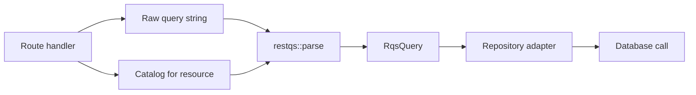
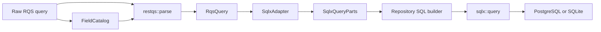

# Integration Guide

These examples target RestQS 0.2.0. See [Migrating to 0.2](migration-0.2.md) when upgrading from 0.1.x.
Registry dependency snippets apply after publication; release-candidate users can substitute a local path dependency.

RestQS keeps framework and database code outside the core parser. A REST handler extracts the raw query string, selects
a field catalog, and parses RQS. A repository receives the `RqsQuery` plan and translates it for the database layer.


```mermaid
flowchart LR
  route["Route handler"] --> raw["Raw query string"]
  route --> catalog["Catalog for resource"]
  raw --> parse["restqs::parse"]
  catalog --> parse
  parse --> plan["RqsQuery"]
  plan --> repo["Repository adapter"]
  repo --> db["Database call"]
```

The plan boundary matters. Web code stays responsible for request extraction. Application code stays responsible for
authorization and catalog choice. Repository code stays responsible for SQL, query builders, transactions, and result
mapping.

## SQLx-Oriented Fragment Generation

Turn on the `sqlx` feature to use the built-in SQL fragment adapter:

```toml
[dependencies]
restqs = { version = "0.2", features = ["sqlx"] }
```

The adapter accepts a parsed plan and returns SQLx-ready parts:

```rust
use restqs::{
    FieldCatalog, RqsValue,
    adapters::sqlx::{SqlDialect, SqlxAdapter, SqlxColumnMap},
    parse,
};

let catalog = FieldCatalog::new()
    .allow_integer("age")?
    .allow_text("status")?;
let query = parse("age>=18&status=active&sort=-age&limit=25", &catalog)?;
let columns = SqlxColumnMap::new()
    .map("age", "users.age")?
    .map("status", "users.status")?;
let parts = SqlxAdapter::new(SqlDialect::Postgres, columns).build(&query)?;

assert_eq!(
    parts.binds,
    vec![RqsValue::Integer(18), RqsValue::Text("active".to_owned())]
);
# Ok::<(), restqs::RqsError>(())
```

The adapter returns the `WHERE` clause without the `WHERE` keyword. It returns the `ORDER BY` clause without the
`ORDER BY` keyword. It keeps `limit` and
`offset` as integers. It stores bind values in placeholder order.

For PostgreSQL, the adapter emits numbered placeholders such as `$1` and `$2`. For MySQL and SQLite, it emits `?`
placeholders. It quotes identifiers with the dialect rules and only quotes columns from the trusted adapter mapping.

Null equality and inequality produce `IS NULL` and `IS NOT NULL` in every supported dialect and consume no bind values.
For example, `status=null&age>=18` produces `"users"."status" IS NULL AND "users"."age" >= $1` for PostgreSQL, with only
`RqsValue::Integer(18)` in `parts.binds`. Bind values from `parts.binds` in order; filter positions do not determine bind
positions. Ordered comparisons with null fail at adapter build time with `adapter_unsupported` and feature metadata
`ordered null comparison`.

## SQLx Repository Pattern

The repository owns the base SQL and the bind calls. RestQS provides the parts. The final assembly lives beside result
mapping and transaction code.

The compiled [users repository](../examples/support/users.rs) owns the catalog, trusted column map, projection
validation, and final SELECT assembly. It shares [pagination](../examples/support/pagination.rs) and
[result budgets](../examples/support/budget.rs) with the driver fixtures. These are application-owned examples,
not exported library APIs. To adapt them, copy those three files as sibling modules in your application.

`SqlStatement` keeps completed SQL and its full bind sequence together. Bind `statement.binds`, including pagination,
in order. A filter such as `status=active&limit=25` binds text `active`, then integer `25`.
The repository owns schema-specific conversion, connection management, transactions, and row decoding.

### Composing With Caller-Owned Predicates

When a PostgreSQL base statement already uses `$1`, call `adapter.build_with_bind_start(&query, 2)`.
The starting position is one-based and belongs to this build only. `build(&query)` continues to start at `$1`.
Every generated scalar, list item, and regex pattern advances the sequence; null and existence predicates do not.
The returned `parts.binds` contains only generated filter values. Bind the base statement's values first.
MySQL and SQLite accept the same API but retain anonymous `?` placeholders and positional binding.

Zero is invalid even for an empty plan (`invalid_bind_position`). Each generated position uses checked addition;
exceeding `usize` returns `bind_position_overflow`. This checks arithmetic, not database or driver parameter limits.
The repository must enforce the limits of its execution backend.

[The tenant composition module](../examples/support/tenant.rs) compiles in the repository tests. Copy it alongside
`pagination.rs` as `tenant.rs` and declare both modules. It reserves `$1` for a tenant ID supplied by authenticated
application context, adds generated filters in parentheses with `AND`, and preserves projection and sorting. It
prepends the tenant value before calling the pagination helper, so that helper sees the complete base bind sequence.
The tenant field is absent from the public catalog; a query cannot choose or replace the authorized tenant.

The executable source is covered by [tenant composition tests](../tests/repository_pagination.rs). For
`status=active&limit=25` with authenticated tenant `42`, its SQL includes
`WHERE "users"."tenant_id" = $1 AND ("users"."status" = $2) LIMIT $3`, binding
`Integer(42)`, `Text("active")`, then `Integer(25)`.

Bind `statement.binds` in order using the repository's schema-aware SQLx binder. This assembly example has a dynamic
projection and no row decoder; applications using it must decode the selected columns. The fixed response repositories
below have their own projection contract.

### Pagination Contract

The shared module appends pagination after the repository's filters and ordering. The base SQL must contain exactly
the base placeholders described by `parts.binds` (including any caller-owned values), and no pagination or trailing semicolon. PostgreSQL numbering starts
at `parts.binds.len() + 1`, so lists and null comparisons do not shift pagination incorrectly. SQLite uses positional
placeholders. Both bind filter values first, then the supplied limit, then the supplied offset, regardless of query
parameter order.

| Requested controls | PostgreSQL suffix after one filter bind | SQLite suffix | Appended binds |
| --- | --- | --- | --- |
| `limit=1&skip=2` | `LIMIT $2 OFFSET $3` | `LIMIT ? OFFSET ?` | `Integer(1), Integer(2)` |
| `limit=1` | `LIMIT $2` | `LIMIT ?` | `Integer(1)` |
| `skip=2` | `OFFSET $2` | `LIMIT -1 OFFSET ?` | `Integer(2)` |
| Neither | None | None | None |

PostgreSQL permits an offset without a limit. SQLite requires a limit when using an offset; the fixed `-1` sentinel
means no upper bound and consumes no bind. See [PostgreSQL LIMIT and OFFSET](https://www.postgresql.org/docs/current/queries-limit.html)
and [SQLite's LIMIT clause](https://www.sqlite.org/lang_select.html#the_limit_clause).

Both values use `i64::try_from`, matching the signed integer binds used by these repositories. Values above `i64::MAX`
return `TryFromIntError` before a SQLx query is created. They are never narrowed with `as`, clamped, or turned into an
unlimited sentinel. `limit=0` is preserved and returns no rows.

The low-level pagination and tenant assembly helpers preserve an omitted limit as **no row cap**, including offset-only requests.
The fixed-response user repositories below enforce a default result budget. The parser's `max_limit`
only bounds an explicitly supplied limit; it does not add a default. Applications using `fetch_all` should enforce
their own default or required limit before calling these repositories. For repeatable pages, repository ordering must
include a unique key; pagination does not invent an ordering or protect against changes between requests.

Run the focused SQL and bind-sequence checks without a database or SQLx dependency:

```sh
cargo test --all-features --test repository_pagination
```

These tests compile the same pagination module linked above and cover both dialects, limit-only and offset-only
requests, null and list filter binds, zero values, omitted limits, and signed-integer boundaries. They also run in
`make test`. Database execution remains the application's responsibility.

### Production Result Budgets

`ParserLimits::max_limit` only checks an explicit request limit. Empty queries keep `limit=None`, and the parser accepts
any `u64` offset. Those input limits do not establish an execution budget. The example user repositories apply the pure,
application-owned [QueryBudget](../examples/support/budget.rs) before pagination assembly:

| Policy | Omitted limit | Explicit limit | Maximum offset (inclusive) |
| --- | --- | --- | --- |
| `QueryBudget::default()` | 25 | 0 through 100 | 10,000 |
| `QueryBudget::bounded(default, max, offset)` | Configured positive default | 0 through configured maximum | Configured maximum |
| `QueryBudget::unbounded_internal()` | Uncapped | Preserved | No policy cap |

`postgres_users_statement` and `sqlite_users_statement` use the default policy. Call their `_with_budget` variants for
custom policy. Configuration requires a positive default within the maximum and signed database integer range.
Excessive request limits and offsets return repository errors before execution; values are rejected, never clamped.
`limit=0` still means zero rows. Filter values precede the effective limit and offset in the bind vector.

Only trusted application code may select `unbounded_internal()` for a deliberate internal job. It is not an RQS control
and does not bypass parser limits or `i64::try_from` during SQL pagination. Even this policy rejects numeric values the
database cannot represent. The low-level assembly helpers remain available for repositories with their own policy.

Row counts and offset budgets do not bound execution time. Set a repository-owned database statement timeout and an
application deadline covering acquisition, execution, and row collection. Configure cancellation/connection cleanup for
the chosen driver; an expired request deadline alone does not prove that the server stopped work. Keep regex disabled
on public routes by default. If enabled, use a separately authorized catalog, supported flags, a database execution
budget, and bounded concurrency; pattern length and output limits alone do not bound regex execution cost. None of these
connection and scheduling decisions belong in the parser.

Run `cargo test --all-features --test repository_budget` for default caps, inclusive offset boundaries, custom policies,
and checked integer conversion under the explicit internal opt-in.

## SQLx Repository Examples

The crate does not depend on SQLx, Tokio, PostgreSQL, or SQLite. Application code chooses those crates and versions in
its own manifest. The linked executable examples show the path from raw RQS text to database rows. They keep request extraction,
parsing, SQL assembly, bind mapping, and row decoding in distinct functions.


```mermaid
flowchart LR
  raw["Raw RQS query"] --> catalog["FieldCatalog"]
  raw --> parser["restqs::parse"]
  catalog --> parser
  parser --> plan["RqsQuery"]
  plan --> adapter["SqlxAdapter"]
  adapter --> parts["SqlxQueryParts"]
  parts --> builder["Repository SQL builder"]
  builder --> sqlx["sqlx::query"]
  sqlx --> db["PostgreSQL or SQLite"]
```

Both repositories return a fixed `(i64, String)` response containing `id` and `name`. They accept omitted/empty
`fields`, `fields=id,name`, or `fields=name,id`. SQL column order is normalized because decoding uses column names.
Other projections, including `fields=status`, `fields=id`, and `fields=name`, return `adapter_unsupported` with feature
`users projection other than id and name` before query execution. Filter and sort access to other catalog fields is
unchanged. Dynamic projection needs a different response type and decoder; these endpoints do not silently ignore it.

Copy [the users module](../examples/support/users.rs), [the budget module](../examples/support/budget.rs), and
`pagination.rs` as sibling modules, and declare all three.
The module owns the endpoint catalog, trusted column mappings, projection validation, and SQL assembly. Its fixed
response columns are always authorized by `users_catalog`. The [repository tests](../tests/repository_users.rs) compile
this exact module and check both dialects' projection behavior with one assertion per test.

The driver examples use `sqlx::query` instead of SQLx macros. That keeps query text assembled at runtime. The application still
binds every value through SQLx.

### PostgreSQL

This example is compiled and executed with SQLx 0.9.0 and PostgreSQL 18.6 by
[the service fixture](https://github.com/OneTesseractInMultiverse/restqs/tree/main/integration-tests/services).
SQLx 0.9 requires Rust 1.94 or newer; RestQS itself retains Rust 1.85 support. An application can depend on SQLx in its own manifest:

```toml
[dependencies]
restqs = { version = "0.2", features = ["sqlx"] }
sqlx = { version = "0.9.0", default-features = false, features = ["postgres", "runtime-tokio"] }
```

SQLx 0.9's `AssertSqlSafe` marks the reviewed dynamic statement: fixed repository syntax plus authorized mapped
identifiers and placeholders, with all values bound separately. It does not sanitize arbitrary SQL. The executable
[source](https://github.com/OneTesseractInMultiverse/restqs/blob/main/integration-tests/services/src/postgres.rs) keeps this
operation in a private executor. The SQLite example uses the same SQLx 0.9 trust marker.

Use the fixture's [PostgreSQL repository source](https://github.com/OneTesseractInMultiverse/restqs/blob/main/integration-tests/services/src/postgres.rs)
as the canonical binding example. `list_users` parses and assembles a bounded statement; its private executor binds
values and fetches rows; `decode_users` maps the fixed response. The source is compiled and executed in CI so driver
API changes cannot silently invalidate a copied documentation snippet.

The scalar binder handles booleans, integers, floats, and text. Dates, timestamps, and UUIDs use text storage in these
examples. Applications with native typed columns must supply schema-appropriate conversions and SQLx features.
Nested list binds are rejected because membership lists must already be flattened by the adapter.

The shared pagination module appends numbered placeholders after `parts.binds.len()` and supplies the corresponding
integer values in `statement.binds`. For `status=active&limit=1&skip=1`, the last two placeholders are `$2` and `$3`.

### SQLite

An application that uses SQLite can depend on SQLx in its own manifest:

```toml
[dependencies]
restqs = { version = "0.2", features = ["sqlx"] }
sqlx = { version = "0.9.0", default-features = false, features = ["sqlite", "runtime-tokio"] }
```

SQLite uses `?` placeholders. The shared users builder appends authorized `ORDER BY` terms after filters and before
pagination. For example, `status=active&sort=age,-name&limit=2&skip=1` yields:

```sql
SELECT "users"."id", "users"."name" FROM users
WHERE "users"."status" = ?
ORDER BY "users"."age" ASC, "users"."name" DESC LIMIT ? OFFSET ?
```

The binds are `Text("active"), Integer(2), Integer(1)`. Omitted sorting adds no ordering clause; applications needing
repeatable pagination should include a unique tie-breaker such as `sort=age,id`.

The [SQLite repository source](https://github.com/OneTesseractInMultiverse/restqs/blob/main/integration-tests/sqlite/src/lib.rs)
contains the complete parse, assembly, bind, execute, and decode flow. It uses the same shared users, budget, and
pagination modules as the PostgreSQL example, with SQLite-specific scalar binding. SQLx 0.9.0 requires Rust 1.94;
the library itself still supports Rust 1.85. Dynamic SQL uses `AssertSqlSafe` only after trusted repository assembly.

The [isolated SQLite fixture](https://github.com/OneTesseractInMultiverse/restqs/tree/main/integration-tests/sqlite)
compiles this binding and row-decoding flow and includes the same users and pagination modules by path. Run
`make verify-sqlite` from a repository checkout. It executes SQLx 0.9.0 with bundled SQLite 3.51.3 in memory, checking
returned rows for both sort directions, multiple terms, and pagination. No server or credentials are needed. This
separate test crate is excluded from the published package and ordinary unit suite; the stable Rust CI job runs it explicitly.

### Database Conformance Suites

The SQLite fixture covers scalar and null filters, list membership/exclusion, projection, ordering, pagination, and
actual default caps. The [service fixture](https://github.com/OneTesseractInMultiverse/restqs/tree/main/integration-tests/services)
compiles PostgreSQL and MySQL binding/decoding and executes equivalent contracts plus supported regex against PostgreSQL
18.6 and MySQL 26.7.0. MySQL's bounded policy always supplies a limit, so offset-only input uses `LIMIT ? OFFSET ?`.
Regex is enabled only in the separate fixture catalog. These test repositories use a fixed `id,name` response.

Run `make verify-sqlite` without services, or configure the two test URLs documented in the fixture README and run
`make verify-services`. Stable CI supplies isolated services and executes the suite as part of the required Rust check.
The core unit suite and published crate remain independent of database drivers and connection configuration.

### Security Boundary In The Examples

The examples do not concatenate raw query values into SQL. Logical fields are authorized by `FieldCatalog` and physical
SQL identifiers come from the separately configured `SqlxColumnMap`. Missing mappings fail before execution. Fixed SQL
keywords come from repository code. User values enter the database through `.bind(...)`.

The normal users entry points leave regex disabled; the service fixture has a separate opt-in regex entry point. Text search remains unsupported. Date, date-time, and UUID values stay as text in
the example bind functions, which mirrors the parser contract.

## Web Handlers

Read the raw query component from the request URI, without a leading `?` or prior form decoding. Select an authorized
catalog and call `parse`. The library is independent of the web framework and response serialization format.

```rust
use restqs::{FieldCatalog, RqsQuery, parse};

/// Parse an endpoint query against its application-owned field authorization.
fn parse_users_query(raw_query: &str) -> restqs::RqsResult<RqsQuery> {
    let catalog = FieldCatalog::new()
        .allow_text("status")?
        .allow_integer("age")?
        .allow_boolean("active")?;

    parse(raw_query, &catalog)
}
```

Keep authentication, HTTP status mapping, request deadlines, and response serialization in application code.

## Custom Repository Adapters

A custom adapter reads `RqsQuery` and returns a repository-specific type. The adapter has one job: translate a valid
plan into query builder data. It does not parse request text and does not decide authorization.

```rust
use restqs::{FilterOp, RqsQuery};

/// Count ordered predicates without changing the immutable query plan.
fn count_range_filters(query: &RqsQuery) -> usize {
    query
        .filters()
        .iter()
        .filter(|filter| {
            matches!(
                filter.op(),
                FilterOp::Gt | FilterOp::Gte | FilterOp::Lt | FilterOp::Lte
            )
        })
        .count()
}

let query = RqsQuery::new();

assert_eq!(count_range_filters(&query), 0);
```

Use a custom adapter for a query builder that has no built-in RestQS feature. Keep any database-specific behavior inside
that adapter. Regex translation, case folding, collation behavior, and date comparison rules all belong there.

## Integration Checklist

The parser and adapter boundaries stay safest with a few rules:

- Build the catalog per endpoint or authorization context.
- Keep physical columns in trusted adapter mappings, separate from the logical catalog and request data.
- Bind every value through the database library.
- Keep regex off until the adapter has dialect rules and cost limits.
- Treat `text_search_unsupported` as a deliberate release constraint.
- Map `RqsError::error_code()` to stable client responses.
