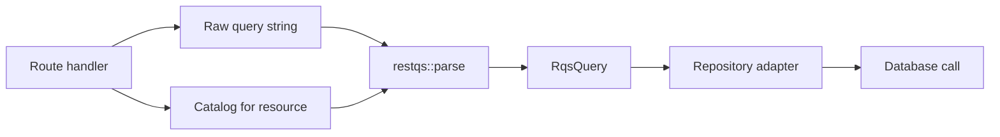
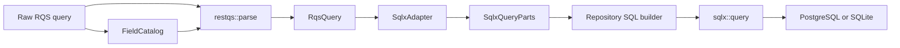
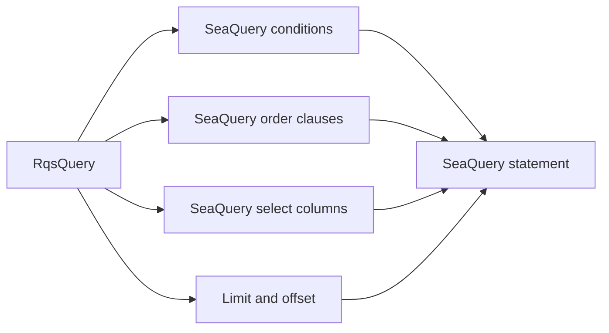

# Integration Guide

These examples target the unreleased 0.2 API and use a local checkout at `../restqs` in dependency snippets.
See [Migrating to 0.2](migration-0.2.md) for the released 0.1.x constructor changes.

RestQS keeps framework and database code outside the core parser. A REST handler extracts the raw query string, selects
a field catalog, and parses RQS. A repository receives the `RqsQuery` plan and translates it for the database layer.


```mermaid
flowchart LR
  route["Route handler"] --> raw["Raw query string"]
  route --> catalog["Catalog for resource"]
  raw --> parse["restqs::parse"]
  catalog --> parse
  parse --> plan["RqsQuery"]
  plan --> repo["Repository adapter"]
  repo --> db["Database call"]
```

The plan boundary matters. Web code stays responsible for request extraction. Application code stays responsible for
authorization and catalog choice. Repository code stays responsible for SQL, query builders, transactions, and result
mapping.

## SQLx-Oriented Fragment Generation

Turn on the `sqlx` feature to use the built-in SQL fragment adapter:

```toml
[dependencies]
restqs = { path = "../restqs", features = ["sqlx"] }
```

The adapter accepts a parsed plan and returns SQLx-ready parts:

```rust
use restqs::{
    FieldCatalog, RqsValue, parse,
    adapters::sqlx::{SqlDialect, SqlxAdapter, SqlxColumnMap},
};

let catalog = FieldCatalog::new()
.allow_integer("age") ?
.allow_text("status") ?;
let query = parse("age>=18&status=active&sort=-age&limit=25", & catalog) ?;
let columns = SqlxColumnMap::new()
    .map("age", "users.age")?
    .map("status", "users.status")?;
let parts = SqlxAdapter::new(SqlDialect::Postgres, columns).build( & query) ?;

assert_eq!(
    parts.binds,
    vec![RqsValue::Integer(18), RqsValue::Text("active".to_owned())]
);
# Ok::<(), restqs::RqsError>(())
```

The adapter returns the `WHERE` clause without the `WHERE` keyword. It returns the `ORDER BY` clause without the
`ORDER BY` keyword. It keeps `limit` and
`offset` as integers. It stores bind values in placeholder order.

For PostgreSQL, the adapter emits numbered placeholders such as `$1` and `$2`. For MySQL and SQLite, it emits `?`
placeholders. It quotes identifiers with the dialect rules and only quotes columns from the trusted adapter mapping.

Null equality and inequality produce `IS NULL` and `IS NOT NULL` in every supported dialect and consume no bind values.
For example, `status=null&age>=18` produces `"users"."status" IS NULL AND "users"."age" >= $1` for PostgreSQL, with only
`RqsValue::Integer(18)` in `parts.binds`. Bind values from `parts.binds` in order; filter positions do not determine bind
positions. Ordered comparisons with null fail at adapter build time with `adapter_unsupported` and feature metadata
`ordered null comparison`.

## SQLx Repository Pattern

The repository owns the base SQL and the bind calls. RestQS provides the parts. The final assembly lives beside result
mapping and transaction code.

The examples below share [the pagination module](../examples/support/pagination.rs). For a standalone example, copy that
file beside `main.rs` as `pagination.rs` and declare `mod pagination;` at crate scope. Adjust the module path for your
application's layout. This is application-owned example code, not an exported RestQS API. Its `SqlStatement` keeps
completed SQL and the full bind sequence together.

```rust
mod pagination;

use pagination::{SqlStatement, append_postgres_pagination};
use restqs::{RqsValue, adapters::sqlx::SqlxQueryParts};

fn users_select_sql(parts: &SqlxQueryParts) -> Result<SqlStatement, std::num::TryFromIntError> {
    let projection = if parts.projection.is_empty() {
        "\"users\".\"id\", \"users\".\"status\"".to_owned()
    } else {
        parts.projection.join(", ")
    };

    let mut sql = format!("SELECT {projection} FROM \"users\"");
    if let Some(where_clause) = &parts.where_clause {
        sql.push_str(" WHERE ");
        sql.push_str(where_clause);
    }
    if let Some(order_by) = &parts.order_by {
        sql.push_str(" ORDER BY ");
        sql.push_str(order_by);
    }
    append_postgres_pagination(&sql, parts)
}

let parts = SqlxQueryParts {
where_clause: Some("\"users\".\"status\" = $1".to_owned()),
projection: Vec::new(),
order_by: None,
limit: Some(25),
offset: None,
binds: vec![RqsValue::Text("active".to_owned())],
};

let statement = users_select_sql(&parts)?;

assert_eq!(
    statement.sql,
    "SELECT \"users\".\"id\", \"users\".\"status\" FROM \"users\" WHERE \"users\".\"status\" = $1 LIMIT $2"
);
# Ok::<(), std::num::TryFromIntError>(())
```

Real SQLx code then binds each `RqsValue` with the matching database type. Keep that mapping inside the repository. That
location has the schema knowledge needed for precise binding. Bind `statement.binds`, which includes pagination, rather
than only `parts.binds`. The example above binds `Text("active")` followed by `Integer(25)`.

### Composing With Caller-Owned Predicates

When a PostgreSQL base statement already uses `$1`, call `adapter.build_with_bind_start(&query, 2)`.
The starting position is one-based and belongs to this build only. `build(&query)` continues to start at `$1`.
Every generated scalar, list item, and regex pattern advances the sequence; null and existence predicates do not.
The returned `parts.binds` contains only generated filter values. Bind the base statement's values first.
MySQL and SQLite accept the same API but retain anonymous `?` placeholders and positional binding.

Zero is invalid even for an empty plan (`invalid_bind_position`). Each generated position uses checked addition;
exceeding `usize` returns `bind_position_overflow`. This checks arithmetic, not database or driver parameter limits.
The repository must enforce the limits of its execution backend.

[The tenant composition module](../examples/support/tenant.rs) compiles in the repository tests. Copy it alongside
`pagination.rs` as `tenant.rs` and declare both modules. It reserves `$1` for a tenant ID supplied by authenticated
application context, adds generated filters in parentheses with `AND`, and preserves projection and sorting. It
prepends the tenant value before calling the pagination helper, so that helper sees the complete base bind sequence.
The tenant field is absent from the public catalog; a query cannot choose or replace the authorized tenant.

```rust
mod pagination;
mod tenant;

use restqs::{FieldCatalog, parse, adapters::sqlx::SqlxColumnMap};

let catalog = FieldCatalog::new().allow_integer("id")?.allow_text("status")?;
let columns = SqlxColumnMap::new().map("id", "users.id")?.map("status", "users.status")?;
let query = parse("status=active&limit=25", &catalog)?;
let authenticated_tenant_id = 42; // Supplied by the application's authorization context.
let statement = tenant::tenant_users_statement(&query, columns, authenticated_tenant_id)?;
// SQL: SELECT "users"."id", "users"."status" FROM users
//      WHERE "users"."tenant_id" = $1 AND ("users"."status" = $2) LIMIT $3
// Bind in order: Integer(42), Text("active"), Integer(25).
# Ok::<(), Box<dyn std::error::Error>>(())
```

Bind `statement.binds` in order using the repository's schema-aware SQLx binder. This assembly example has a dynamic
projection and no row decoder; applications using it must decode the selected columns. The fixed response repositories
below have their own projection contract.

### Pagination Contract

The shared module appends pagination after the repository's filters and ordering. The base SQL must contain exactly
the base placeholders described by `parts.binds` (including any caller-owned values), and no pagination or trailing semicolon. PostgreSQL numbering starts
at `parts.binds.len() + 1`, so lists and null comparisons do not shift pagination incorrectly. SQLite uses positional
placeholders. Both bind filter values first, then the supplied limit, then the supplied offset, regardless of query
parameter order.

| Requested controls | PostgreSQL suffix after one filter bind | SQLite suffix | Appended binds |
| --- | --- | --- | --- |
| `limit=1&skip=2` | `LIMIT $2 OFFSET $3` | `LIMIT ? OFFSET ?` | `Integer(1), Integer(2)` |
| `limit=1` | `LIMIT $2` | `LIMIT ?` | `Integer(1)` |
| `skip=2` | `OFFSET $2` | `LIMIT -1 OFFSET ?` | `Integer(2)` |
| Neither | None | None | None |

PostgreSQL permits an offset without a limit. SQLite requires a limit when using an offset; the fixed `-1` sentinel
means no upper bound and consumes no bind. See [PostgreSQL LIMIT and OFFSET](https://www.postgresql.org/docs/current/queries-limit.html)
and [SQLite's LIMIT clause](https://www.sqlite.org/lang_select.html#the_limit_clause).

Both values use `i64::try_from`, matching the signed integer binds used by these repositories. Values above `i64::MAX`
return `TryFromIntError` before a SQLx query is created. They are never narrowed with `as`, clamped, or turned into an
unlimited sentinel. `limit=0` is preserved and returns no rows.

These examples preserve an omitted limit as **no row cap**, including offset-only requests. The parser's `max_limit`
only bounds an explicitly supplied limit; it does not add a default. Applications using `fetch_all` should enforce
their own default or required limit before calling these repositories. For repeatable pages, repository ordering must
include a unique key; pagination does not invent an ordering or protect against changes between requests.

Run the focused SQL and bind-sequence checks without a database or SQLx dependency:

```sh
cargo test --all-features --test repository_pagination
```

These tests compile the same pagination module linked above and cover both dialects, limit-only and offset-only
requests, null and list filter binds, zero values, omitted limits, and signed-integer boundaries. They also run in
`make test`. Database execution remains the application's responsibility.

## Documentation-Only SQLx Examples

The crate does not depend on SQLx, Tokio, PostgreSQL, or SQLite. Application code chooses those crates and versions in
its own manifest. The following snippets show the path from raw RQS text to database rows. They keep request extraction,
parsing, SQL assembly, bind mapping, and row decoding in distinct functions.


```mermaid
flowchart LR
  raw["Raw RQS query"] --> catalog["FieldCatalog"]
  raw --> parser["restqs::parse"]
  catalog --> parser
  parser --> plan["RqsQuery"]
  plan --> adapter["SqlxAdapter"]
  adapter --> parts["SqlxQueryParts"]
  parts --> builder["Repository SQL builder"]
  builder --> sqlx["sqlx::query"]
  sqlx --> db["PostgreSQL or SQLite"]
```

Both repositories return a fixed `(i64, String)` response containing `id` and `name`. They accept omitted/empty
`fields`, `fields=id,name`, or `fields=name,id`. SQL column order is normalized because decoding uses column names.
Other projections, including `fields=status`, `fields=id`, and `fields=name`, return `adapter_unsupported` with feature
`users projection other than id and name` before query execution. Filter and sort access to other catalog fields is
unchanged. Dynamic projection needs a different response type and decoder; these endpoints do not silently ignore it.

Copy [the users module](../examples/support/users.rs) alongside `pagination.rs` as `users.rs`, and declare both modules.
The module owns the endpoint catalog, trusted column mappings, projection validation, and SQL assembly. Its fixed
response columns are always authorized by `users_catalog`. The [repository tests](../tests/repository_users.rs) compile
this exact module and check both dialects' projection behavior with one assertion per test.

The snippets use `sqlx::query` instead of SQLx macros. That keeps query text assembled at runtime. The application still
binds every value through SQLx.

### PostgreSQL

An application that uses PostgreSQL can depend on SQLx in its own manifest:

```toml
[dependencies]
restqs = { path = "../restqs", features = ["sqlx"] }
sqlx = { version = "0.8", default-features = false, features = ["postgres", "runtime-tokio"] }
```

Repository code can then translate a parsed plan into a SQLx query. The example below binds text, integer, boolean, and
float values. Date, date-time, and UUID values stay as text here. A repository can bind those variants to richer database
types after it owns the schema rules.

```rust
mod pagination;
mod users;

use restqs::{RqsValue, parse};
use users::{postgres_users_statement, users_catalog};
use sqlx::{PgPool, Row};

async fn list_users(pool: &PgPool, raw: &str) -> Result<Vec<(i64, String)>, Box<dyn std::error::Error>> {
    let query = parse(raw, &users_catalog()?)?;
    let statement = postgres_users_statement(&query)?;
    let mut query = sqlx::query(&statement.sql);

    for value in &statement.binds {
        query = bind_postgres_value(query, value)?;
    }

    let rows = query.fetch_all(pool).await?;
    Ok(decode_postgres_users(rows)?)
}

fn decode_postgres_users(rows: Vec<sqlx::postgres::PgRow>) -> Result<Vec<(i64, String)>, sqlx::Error> {
    rows
        .into_iter()
        .map(|row| Ok((row.try_get("id")?, row.try_get("name")?)))
        .collect()
}

fn bind_postgres_value<'query>(
    query: sqlx::query::Query<'query, sqlx::Postgres, sqlx::postgres::PgArguments>,
    value: &'query RqsValue,
) -> Result<sqlx::query::Query<'query, sqlx::Postgres, sqlx::postgres::PgArguments>, restqs::RqsError> {
    match value {
        RqsValue::Null => Ok(query.bind(Option::<String>::None)),
        RqsValue::Boolean(value) => Ok(query.bind(*value)),
        RqsValue::Integer(value) => Ok(query.bind(*value)),
        RqsValue::Float(value) => Ok(query.bind(*value)),
        RqsValue::Text(value)
        | RqsValue::Date(value)
        | RqsValue::DateTime(value)
        | RqsValue::Uuid(value) => Ok(query.bind(value.as_str())),
        RqsValue::List(_) => Err(restqs::RqsError::AdapterUnsupported {
            feature: "nested list bind",
        }),
    }
}
```

The shared pagination module appends numbered placeholders after `parts.binds.len()` and supplies the corresponding
integer values in `statement.binds`. For `status=active&limit=1&skip=1`, the last two placeholders are `$2` and `$3`.

### SQLite

An application that uses SQLite can depend on SQLx in its own manifest:

```toml
[dependencies]
restqs = { path = "../restqs", features = ["sqlx"] }
sqlx = { version = "0.8", default-features = false, features = ["sqlite", "runtime-tokio"] }
```

SQLite uses `?` placeholders. The repository can reuse the same catalog and bind mapping style:

```rust
mod pagination;
mod users;

use restqs::{RqsValue, parse};
use users::{sqlite_users_statement, users_catalog};
use sqlx::{Row, SqlitePool};

async fn list_sqlite_users(pool: &SqlitePool, raw: &str) -> Result<Vec<(i64, String)>, Box<dyn std::error::Error>> {
    let query = parse(raw, &users_catalog()?)?;
    let statement = sqlite_users_statement(&query)?;
    let mut query = sqlx::query(&statement.sql);

    for value in &statement.binds {
        query = bind_sqlite_value(query, value)?;
    }

    let rows = query.fetch_all(pool).await?;
    Ok(decode_sqlite_users(rows)?)
}

fn decode_sqlite_users(rows: Vec<sqlx::sqlite::SqliteRow>) -> Result<Vec<(i64, String)>, sqlx::Error> {
    rows
        .into_iter()
        .map(|row| Ok((row.try_get("id")?, row.try_get("name")?)))
        .collect()
}

fn bind_sqlite_value<'query>(
    query: sqlx::query::Query<'query, sqlx::Sqlite, sqlx::sqlite::SqliteArguments<'query>>,
    value: &'query RqsValue,
) -> Result<sqlx::query::Query<'query, sqlx::Sqlite, sqlx::sqlite::SqliteArguments<'query>>, restqs::RqsError> {
    match value {
        RqsValue::Null => Ok(query.bind(Option::<String>::None)),
        RqsValue::Boolean(value) => Ok(query.bind(*value)),
        RqsValue::Integer(value) => Ok(query.bind(*value)),
        RqsValue::Float(value) => Ok(query.bind(*value)),
        RqsValue::Text(value)
        | RqsValue::Date(value)
        | RqsValue::DateTime(value)
        | RqsValue::Uuid(value) => Ok(query.bind(value.as_str())),
        RqsValue::List(_) => Err(restqs::RqsError::AdapterUnsupported {
            feature: "nested list bind",
        }),
    }
}
```

### Security Boundary In The Examples

The examples do not concatenate raw query values into SQL. Logical fields are authorized by `FieldCatalog` and physical
SQL identifiers come from the separately configured `SqlxColumnMap`. Missing mappings fail before execution. Fixed SQL
keywords come from repository code. User values enter the database through `.bind(...)`.

The snippets treat regex as disabled. Text search remains unsupported. Date, date-time, and UUID values stay as text in
the example bind functions, which mirrors the parser contract.

## Axum And Serde

RestQS does not depend on Axum or Serde. In Axum, read the raw query string from the request URI. Then select a catalog
and call `parse`.

```rust
use restqs::{FieldCatalog, RqsQuery, parse};

fn parse_users_query(raw_query: &str) -> restqs::RqsResult<RqsQuery> {
    let catalog = FieldCatalog::new()
        .allow_text("status")?
        .allow_integer("age")?
        .allow_boolean("active")?;

    parse(raw_query, &catalog)
}
```

Serde can still parse route bodies and response data. RestQS focuses only on query syntax. That split avoids a hard
dependency on one web framework.

## SeaORM And SeaQuery

SeaORM uses SeaQuery for many query builder tasks. RestQS can feed that path through the neutral `RqsQuery` plan. The
current release does not ship a SeaQuery adapter, but the plan already carries the needed data:

| RestQS item               | SeaQuery concept                 |
|---------------------------|----------------------------------|
| `Filter`                  | Condition expression             |
| `FilterOp`                | Comparison or existence operator |
| `FieldRef::public_name()` | Logical key resolved by the repository's trusted storage mapping |
| `SortTerm`                | Ordered expression               |
| `Projection`              | Select expression list           |
| `Pagination`              | Limit and offset                 |

A SeaQuery adapter can translate these items without changing the parser. It must still bind values, reject unsupported
operators, and gate regex per dialect.


```mermaid
flowchart LR
  plan["RqsQuery"] --> condition["SeaQuery conditions"]
  plan --> order["SeaQuery order clauses"]
  plan --> select["SeaQuery select columns"]
  plan --> paging["Limit and offset"]
  condition --> query["SeaQuery statement"]
  order --> query
  select --> query
  paging --> query
```

## Custom Repository Adapters

A custom adapter reads `RqsQuery` and returns a repository-specific type. The adapter has one job: translate a valid
plan into query builder data. It does not parse request text and does not decide authorization.

```rust
use restqs::{FilterOp, RqsQuery};

fn count_range_filters(query: &RqsQuery) -> usize {
    query
        .filters()
        .iter()
        .filter(|filter| matches!(filter.op(), FilterOp::Gt | FilterOp::Gte | FilterOp::Lt | FilterOp::Lte))
        .count()
}

let query = RqsQuery::new();

assert_eq!(count_range_filters(&query), 0);
```

Use a custom adapter for a query builder that has no built-in RestQS feature. Keep any database-specific behavior inside
that adapter. Regex translation, case folding, collation behavior, and date comparison rules all belong there.

## Integration Checklist

The parser and adapter boundaries stay safest with a few rules:

- Build the catalog per endpoint or authorization context.
- Keep physical columns in trusted adapter mappings, separate from the logical catalog and request data.
- Bind every value through the database library.
- Keep regex off until the adapter has dialect rules and cost limits.
- Treat `text_search_unsupported` as a deliberate release constraint.
- Map `RqsError::error_code()` to stable client responses.
