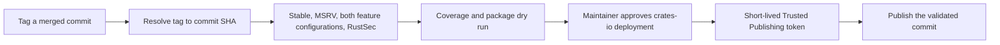

# Publishing

This project publishes to crates.io as `restqs`. Each release must use an unpublished version in `Cargo.toml`.
Published crate versions cannot be overwritten; check the [version history](https://crates.io/crates/restqs/versions)
before preparing an update.

The package ships source, tests, examples, docs, policy files, `Makefile`, `SUPPORT.md`, and `LICENSE`. Release automation
and its Python tests stay in `.github/` and are excluded from the crate.

## Release Flow

Merge the reviewed version and changelog changes into `main`, then create a tag matching `Cargo.toml`, such as `v0.1.1`.
Publishing a GitHub release starts `.github/workflows/publish.yml`.



The resolver accepts an actual tag in `refs/tags/`, peels annotated tags, and checks the manifest from that commit.
A similarly named branch, missing tag, mismatched version, or commit outside `origin/main` is rejected. Manual publication
must run the workflow from `main`. A release event must reference its own tag and commit.

Every downstream checkout uses the resolved full commit SHA. Moving the tag while validation or approval is pending
cannot change the source that is published. The resolved tag and commit appear in the Actions run summary.

The release workflow reuses CI for stable Rust, Rust 1.85.0, and the RustSec audit. Both Rust jobs check, test, and build
documentation with and without `sqlx`; stable also runs formatting, Clippy, release-policy tests, and packaging. A separate
release job requires 100% source line coverage and `cargo publish --dry-run --locked --registry crates-io`. Publication
requires all these jobs to succeed and the environment approval before requesting a crates.io token.

## GitHub Environment

The repository's `crates-io` environment uses the following policy:

| Setting | Value |
| --- | --- |
| Deployment branches and tags | Selected branches and tags |
| Allowed branch | `main` |
| Allowed tags | `v*` |
| Required reviewer | `OneTesseractInMultiverse` |
| Prevent self-review | Disabled for the solo maintainer |
| Allow administrators to bypass protection rules | Disabled |

This gives the maintainer an explicit release approval while allowing them to approve a workflow they started. Add an
independent reviewer and enable prevention of self-review if maintainership expands. Administrators must still use the
normal approval gate.

Configure or inspect these settings under **Settings → Environments → crates-io**. The branch and tag rules refer to the
workflow's event ref, not its checkout SHA: manual publication runs from `main`, and GitHub releases run from `v*` tags.
The resolver additionally requires the tagged commit to be merged into `main`.

Verify the settings through the GitHub CLI:

```sh
gh api repos/OneTesseractInMultiverse/restqs/environments/crates-io
gh api repos/OneTesseractInMultiverse/restqs/environments/crates-io/deployment-branch-policies
```

Expect `can_admins_bypass: false`, the required reviewer, `prevent_self_review: false`, and exactly the `main` branch and
`v*` tag policies. Referencing an environment in YAML alone does not configure these protections.

## Trusted Publishing

In [the crate settings](https://crates.io/crates/restqs/settings), add a GitHub Actions Trusted Publisher with:

| Setting | Value |
| --- | --- |
| GitHub owner or organization | `OneTesseractInMultiverse` |
| Repository | `restqs` |
| Workflow filename | `publish.yml` |
| Environment | `crates-io` |

Confirm all four values in the saved configuration, including the environment. No persistent crates.io token needs to
be stored in GitHub Secrets. The pinned `rust-lang/crates-io-auth-action` exchanges the publish job's OpenID Connect
identity for a short-lived token; only the publish step receives that token. The action revokes it when the job ends.

The crate already exists, so no bootstrap publication is needed. If Trusted Publishing authentication fails, check the
four settings above and the GitHub environment rules before rerunning the workflow. See the
[crates.io Trusted Publishing documentation](https://crates.io/docs/trusted-publishing) and the
[authentication action](https://github.com/rust-lang/crates-io-auth-action).

## Preparing an Update

1. Update `Cargo.toml` to an unpublished version and update `CHANGELOG.md`. Review compatibility and merge the PR.
2. Create and push the matching tag on the reviewed `main` commit. For example, after changing the manifest to `0.1.1`:

   ```sh
   git switch main
   git pull --ff-only
   git tag -a v0.1.1 -m 'Release v0.1.1'
   git push origin v0.1.1
   ```

3. Validate without publishing or creating a GitHub release:

   ```sh
   gh workflow run publish.yml --ref main -f tag=v0.1.1 -f publish=false
   gh run list --workflow publish.yml
   ```

   Inspect that run and its resolved SHA. Validation-only runs never enter the publishing environment and never request
   an OpenID Connect token. They can also run from a branch when testing changes to the workflow, but the target tag
   still has to resolve to a commit merged into `main`.

4. Publish a GitHub release for the existing tag:

   ```sh
   gh release create v0.1.1 --verify-tag --title v0.1.1 --generate-notes
   ```

5. Wait for the release checks, then approve the `crates-io` deployment from the Actions run. Check the published version
   on crates.io and its documentation on docs.rs.

Use manual publication to retry a failed run for an unpublished version:

```sh
gh workflow run publish.yml --ref main -f tag=v0.1.1 -f publish=true
```

Retries run all gates again and still require approval. If an upload timed out, check crates.io before retrying: a
successful upload cannot be repeated with the same version. Fix a published release by preparing a new version.

## Local Verification

Use Python 3.11 or newer for the release-policy tests:

```sh
python3 -m unittest discover -s .github/scripts -p 'test_*.py'
make verify
make coverage
make package-list
make package
cargo publish --dry-run --locked --registry crates-io
```

The Python unit tests use in-memory event and Git fixtures and one assertion per test. They require no credentials,
network, or repository files. `make verify` covers linting, tests, doctests, and docs for both feature configurations.
`make package-list` shows the files sent to crates.io; package verification compiles the packaged copy.

## docs.rs

`make doc` builds documentation with `RUSTDOCFLAGS="--cfg docsrs -D warnings"`, with and without `sqlx`. Broken links
and rustdoc warnings fail the build. GitHub Actions publication does not need a separate docs.rs credential.
