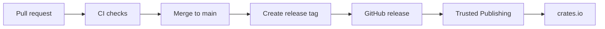

# Publishing

This project publishes to crates.io as `restqs`.

The manifest contains package metadata, repository URL, docs.rs URL, license, keywords, categories, and a crate include
list. The package ships source, tests, examples, docs, policy files, `Makefile`, `SUPPORT.md`, and `LICENSE`.

## Release Flow

Pull requests and pushes to `main` run CI. CI checks formatting, type checking, Clippy, tests, doc tests, docs, package
contents, and RustSec advisories.



Release tags match the version in `Cargo.toml`. Use `vMAJOR.MINOR.PATCH`, such as `v0.1.0`.

## Trusted Publishing

The publish workflow uses crates.io Trusted Publishing through
`rust-lang/crates-io-auth-action`. The workflow requests a short-lived crates.io token through GitHub OpenID Connect,
then passes that token to
`cargo publish`.

Configure the `restqs` crate on crates.io with these repository values:

| Setting                      | Value                      |
|------------------------------|----------------------------|
| GitHub owner or organization | `OneTesseractInMultiverse` |
| Repository                   | `restqs`                   |
| Workflow                     | `publish.yml`              |
| Environment                  | `crates-io`                |

Trusted Publishing removes the need for a long-lived crates.io token in GitHub Secrets. The workflow can publish only
from the configured repository, workflow, and environment.

## First Publish

Trusted Publishing starts after the crate exists on crates.io. The first release uses a local publish from a clean tree.

```sh
make verify
make coverage
make package-list
make package
make publish-dry-run
cargo publish
```

After the first version appears on crates.io, configure Trusted Publishing in the crate settings. Later versions publish
through GitHub Actions.

## Package Verification

`make package-list` shows the files that crates.io receives. Inspect that list before publishing. The package must
include docs, examples, tests, source, policy files, and the MIT license. It must not include build output, editor
metadata, secrets, or machine-specific files.

`cargo package --allow-dirty --offline` verifies the crate from a packaged copy. This catches missing include-list
entries and metadata mistakes before a publish attempt.

## docs.rs

The documentation build uses docs.rs-style flags:

```sh
RUSTDOCFLAGS="--cfg docsrs -D warnings" cargo doc --no-deps --all-features
```

The local `make verify` target runs that command through `make doc`. Broken links and rustdoc warnings fail the build.
