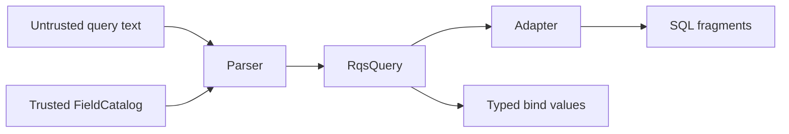
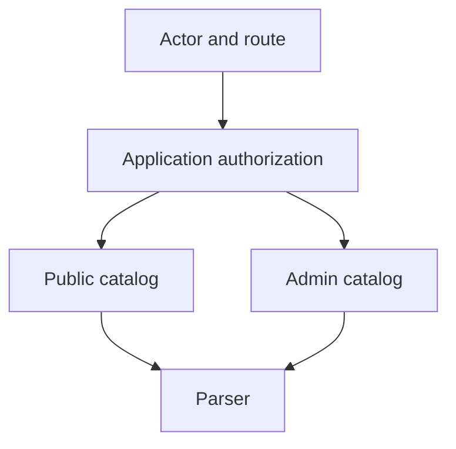

# Security Model

RestQS treats all RQS input as untrusted. The parser protects identifiers, values, optional features, and resource
limits. It does not replace authorization. The host application still decides which fields each actor can use.

The core security idea is simple: user field names never become database identifiers. The parser resolves every public
field through `FieldCatalog`. Adapters receive trusted column metadata from the catalog and typed user values from the
plan.



## Threat Model

RQS appears in query strings. Attackers can send arbitrary field names, operators, values, list sizes, regex patterns,
and pagination values. They can try to expose private fields, inject SQL syntax, force expensive scans, or trigger logs
that reveal private input.

RestQS reduces these risks through a narrow parser contract. It rejects unknown fields. It rejects invalid column
identifiers during catalog creation. It casts values into `RqsValue`. It leaves database-specific execution to adapters
and repositories.

## Identifier Safety

SQL bind parameters protect values. They do not protect column names. A query builder that accepts raw user field names
can still produce unsafe SQL.

RestQS avoids that failure mode with `FieldCatalog`:

```rust
use restqs::FieldCatalog;

let catalog = FieldCatalog::new()
.allow_text("status", "orders.status") ?
.allow_integer("amount", "orders.amount_cents") ?;

assert_eq!(catalog.len(), 2);
# Ok::<(), restqs::RqsError>(())
```

A request for `status` maps to `orders.status`. A request for `secret_token`
fails with `unknown_field`. A field name such as `status drop` fails before the parser builds a plan.

Column names must use dotted identifiers. Quotes, spaces, comments, and SQL syntax are rejected at catalog creation
time. This rule keeps adapters from receiving untrusted SQL fragments.

## Value Safety

The parser casts every value according to the catalog type. The SQLx-oriented adapter returns bind values in placeholder
order. It does not concatenate user values into SQL text.

```rust
use restqs::{
    FieldCatalog, parse,
    adapters::sqlx::{SqlDialect, SqlxAdapter},
};

let catalog = FieldCatalog::new().allow_text("status", "orders.status") ?;
let query = parse("status=active", & catalog) ?;
let parts = SqlxAdapter::new(SqlDialect::Postgres).build( & query) ?;

assert_eq!(parts.where_clause, Some("\"orders\".\"status\" = $1".to_owned()));
# Ok::<(), restqs::RqsError>(())
```

The bind value `active` lives in `parts.binds`. Repository code passes it to SQLx through bind calls. That keeps SQL
syntax and user data separate.

## Regex Safety

Regex is disabled by default. Two gates must open:

- The catalog field must call `allow_regex()`.
- The adapter must call `allow_regex()`.

Regex matching supports `=` only. The parser rejects `!=`, `>`, `>=`, `<`, and `<=` with `invalid_operator` when the value
is a recognized regex literal. Negation and ordered regex comparisons are unsupported; they never become positive-match
plans. After resolving the field, the parser validates value size, then the regex operator, then field permission.
Equality regex matching still requires both gates, and the adapter keeps the pattern in a bind value.

```rust
use restqs::{
    Field, FieldCatalog, FilterOp, ValueKind, parse,
    adapters::sqlx::{SqlDialect, SqlxAdapter},
};

let email = Field::new("email", "users.email", ValueKind::Text) ?.allow_regex();
let catalog = FieldCatalog::new().allow(email) ?;
let query = parse("email=/@example.com$/i", & catalog) ?;
let parts = SqlxAdapter::new(SqlDialect::Postgres)
.allow_regex()
.build( & query) ?;

assert_eq!(query.filters()[0].op(), FilterOp::Regex);
# Ok::<(), restqs::RqsError>(())
```

Regex behavior varies by database. PostgreSQL and MySQL have different syntax and cost profiles. SQLite has no built-in
regex operator in the RestQS adapter. Keep regex off for broad public search endpoints. Turn it on only for fields with
clear bounds, indexes, and operator rules.

## Text Search

Text search is not part of this release. A `$text=` parameter returns
`text_search_unsupported`.

This choice avoids a false sense of portability. Full-text search differs by database, schema, language, tokenizer,
ranking model, and index type. A future adapter can add a dialect-specific text search path without changing the core
plan contract.

## Resource Limits

Default limits reduce accidental high-cost queries:

| Limit                 | Default |
|-----------------------|---------|
| Raw query length      | 8 KiB   |
| Parameter count       | 128     |
| Decoded value length  | 2 KiB   |
| List item count       | 100     |
| Maximum `limit` value | 100     |

`max_value_bytes` counts UTF-8 bytes after percent and plus decoding. It applies to filter values and the `sort`,
`fields`, `limit`, and `skip` controls, including cast wrappers, regex delimiters and flags, and complete comma-separated
lists. For example, `/a/` takes three bytes, while `/é/` takes four. The raw query byte limit applies before decoding.

After resolving a filter's field, the parser checks its value size before interpreting it or checking regex permission.
Oversized values return `value_too_large`, including regex values on fields where regex is disabled. Values within the
size limit still require regex permission. Controls are size-checked before parsing their contents; their error metadata
uses the control name (`sort`, `fields`, `limit`, or `skip`). Existence filters have no value and remain valid when
`max_value_bytes` is zero. List item limits and numeric pagination limits apply independently.

Applications can set tighter limits per endpoint:

```rust
use restqs::{FieldCatalog, Parser, ParserConfig, ParserLimits};

let catalog = FieldCatalog::new().allow_text("status", "orders.status") ?;
let parser = Parser::with_config(
& catalog,
ParserConfig::with_limits(ParserLimits {
max_query_bytes: 1024,
max_parameters: 16,
max_list_items: 20,
max_limit: 50,
..ParserLimits::default ()
}),
);
let query = parser.parse("status=active&limit=25") ?;

assert_eq!(query.pagination().limit(), Some(25));
# Ok::<(), restqs::RqsError>(())
```

Limits do not replace database indexes or query planning. They reduce the shape of request input before repository code
builds a database query.

## Authorization Boundary

RestQS does not decide who can use a field. The application decides that by choosing the catalog. A public request and
an administrator request can use different catalogs for the same resource.



Do not build one global catalog for every route. Build catalogs from resource contracts. Then add authorization rules
before parsing or during catalog selection.

## Logging And Error Responses

`RqsError::error_code()` gives stable strings for API responses. Library-generated Display messages name failure classes
and show field or column names only when they are valid dotted ASCII identifiers of at most 128 bytes. Other names are
replaced in full with `[redacted]`. This prevents embedded newlines, terminal escapes, Unicode direction controls, and
malformed field text containing values from entering the message. Valid identifiers longer than the display limit can
still be registered in the catalog.

Field syntax is validated before catalog lookup for filters, sorting, and projection. Malformed nonempty names now
return `invalid_field_name` rather than `unknown_field`; valid names absent from the catalog still return
`unknown_field`. The error-code strings themselves are unchanged.

Use Display (`{}`) or error codes for ordinary logging. Error fields and Debug (`{:?}`) retain the original input; they
are not redacted and should only be exposed under a deliberate debug policy.

Recommended response mapping:

| Error class                     | HTTP status                                |
|---------------------------------|--------------------------------------------|
| Invalid RQS syntax or value     | `400 Bad Request`                          |
| Unknown field for this resource | `400 Bad Request`                          |
| Field hidden by authorization   | `403 Forbidden` from application code      |
| Adapter unsupported feature     | `400 Bad Request` or `501 Not Implemented` |

Never log full query strings by default on public endpoints. Log error codes, route names, and request identifiers.
Store raw input only under a deliberate debug policy.

## Safe Use Checklist

- Build a catalog per resource or authorization context.
- Keep database column names in code, not in user input.
- Bind every `RqsValue` through the database library.
- Keep regex off for public endpoints until the adapter has dialect rules.
- Keep text search unsupported until a dialect-specific adapter exists.
- Set tighter parser limits for high-traffic endpoints.
- Map `RqsError::error_code()` to stable client responses.
