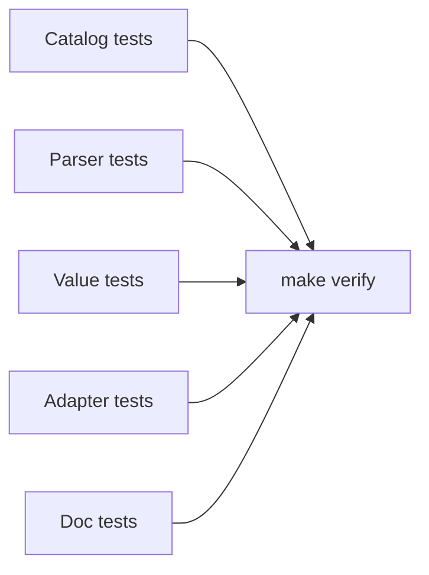

# Testing Guide

RestQS tests mirror the library boundary. Parser tests check RQS input and returned plans. Catalog tests check
identifier validation. Value tests check type parsing. Adapter tests check generated fragments and bind order.

Every test runs in memory. Tests do not need databases, web servers, credentials, environment variables, or special
setup. A contributor can clone the repository, install local tools with `make setup`, and run `make test`.



## One Assertion Rule

Each test function uses one assertion. A test can prepare data, parse input, and call helper functions. The final
verification checks one fact.

```rust
use restqs::{FieldCatalog, FilterOp, parse};

let catalog = FieldCatalog::new().allow_integer("age") ?;
let query = parse("age>=18", & catalog) ?;

assert_eq!(query.filters()[0].op(), FilterOp::Gte);
# Ok::<(), restqs::RqsError>(())
```

This rule follows the library design. A function either coordinates work or computes a value. A test either proves one
behavior or one failure mode.

## Correctness Tests

Coverage alone does not prove behavior. Tests must prove correctness. Each operator needs a positive case. Each failure
mode needs a negative case. Each adapter path needs expected fragment text and bind order.

Compare the complete ordered `RqsValue` vector in a bind test. A length-only assertion cannot detect reordered or
replaced values. Cover list expansion between scalar filters and before a scalar filter, including unsorted and
repeated list values. Keep each expected sequence in its test and setup helpers free of assertions.

Use concrete input. Prefer `age>=18` over synthetic placeholders. Prefer a real catalog entry such as `users.age` over a
vague `table.column` example.

## Failure Tests

Failure tests are part of the public contract. They prove safe defaults and error boundaries.

Important failure cases include:

- Unknown public fields.
- Invalid database column identifiers.
- Missing or duplicate adapter column mappings, including sort-only and projection-only plans.
- Wrong value type for a field.
- Duplicate filters with the same field and operator.
- Regex on a field that does not allow regex.
- Unknown or duplicate regex suffix flags, and recognized flags unsupported by each SQL dialect.
- Text search through `$text=`.
- Pagination above the configured limit.
- Too many parameters or list items.

Error-code tests track compatibility-sensitive `RqsError::error_code()` values. Keep display tests separate: compare
rendered messages against concrete expected text for each relevant error variant. Display wording can change for
clarity when the corresponding tests are updated deliberately.

Safety tests use hostile field and column names to check newline, carriage-return, NUL, and terminal-escape redaction.
Also verify that malformed input and invalid or duplicated filter values do not appear in rendered messages. Preserve
the distinction between valid identifiers, which remain visible within the display byte limit, and malformed or long
identifiers, which become `[redacted]`. Counting messages does not test any of these properties.

## Repository Example Checks

The logical plan and column-mapping tests verify that SQL configuration cannot authorize fields, and that one plan
can be consumed with different SQL schemas or by the [in-memory example](../examples/in_memory.rs). Run the latter
without SQL support using `cargo run --example in_memory --no-default-features`.

The [repository pagination tests](../tests/repository_pagination.rs) compile the same helper module used by the SQLx
integration examples. They verify SQL and complete bind sequences for PostgreSQL and SQLite without database services
or a SQLx dependency. Run them with `cargo test --all-features --test repository_pagination`; `make test` includes them.

## Coverage Command

Run coverage after installing local tools:

```sh
make setup
make coverage
```

The coverage command fails on any uncovered source line. The numeric region summary can still show missed compiler
subregions from error propagation. The gate uses source-line coverage, which matches the project goal for readable Rust
code.

## Local Gates

Run the main test suite:

```sh
make test
```

Run the full local gate:

```sh
make verify
```

`make verify` checks formatting, type checking, Clippy, tests, doc tests, and docs.rs-style documentation. Run it before
sending a pull request.

## Test Review

Review tests with the same care as source code. A good test has a clear name, one assertion, no external service, and a
direct link to required behavior. A test that only increases coverage without proving behavior needs revision.
